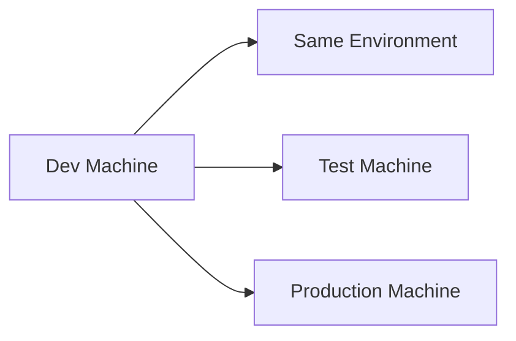
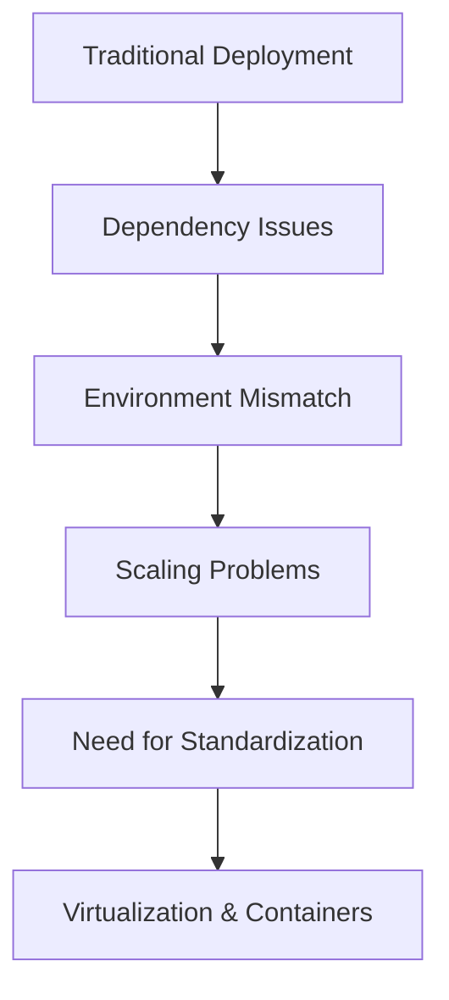

# 🐳 1.1 Evolution of Software Deployment

---

# 📖 Traditional Software Deployment

In early software systems, applications were deployed directly on physical servers 🖥️.

---

## 🏗️ How it worked

- One application per server
- Manual installation of OS + dependencies
- Everything configured manually

---

## ⚠️ Problems

### ❌ 1. Low Resource Utilization
One server → One app  
👉 Most resources stay unused

---

### ❌ 2. Hard to Scale
To scale:
- Buy new servers 💸
- Manually configure everything ⚙️

---

### ❌ 3. Environment Differences
Each server may differ:

- OS version 🖥️
- Library versions 📚
- Configurations ⚙️

---

# 💥 Dependency Hell

Different applications require different versions of same dependency.

### Example:

```text
App A → Python 3.7
App B → Python 3.11
```

👉 Both cannot coexist easily

---

## 🔥 Result

- Version conflicts
- Broken applications
- Hard debugging

---

# 😵 “Works on My Machine” Problem

This is one of the biggest real-world issues in software development.

---

## 💻 Scenario

```text
Developer Machine ✅
Testing Server ❌
Production Server ❌
```

---

## 📉 Why it happens

- Different OS versions
- Missing dependencies
- Different configuration files

---

## 🧠 Core Problem

👉 No consistent environment across systems

---

# 📌 Why Standardization is Needed

To solve these problems, we needed:

---

## 🎯 Requirements

- Same environment everywhere 🌍
- No dependency conflicts 🔒
- Easy deployment 🚀
- Portable applications 📦

---

## 📊 Goal



👉 All environments should behave identically

---

# 🚀 Key Takeaway

Traditional deployment failed because:

- ❌ Manual setup
- ❌ Dependency conflicts
- ❌ Environment mismatch
- ❌ Poor scalability

👉 This created the need for **virtualization and containers (Docker later solves this)**

---

# 📚 Summary

Before Docker:

- Applications were tightly bound to physical machines
- Environments were inconsistent
- Scaling was difficult and expensive
- Deployment was error-prone

👉 This is why **software industry moved towards standardization and containerization**

---

# 🎯 Final Flow



---