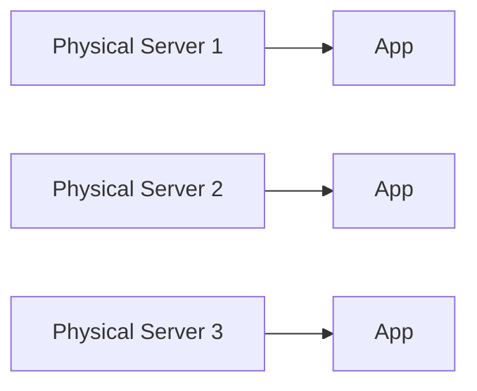
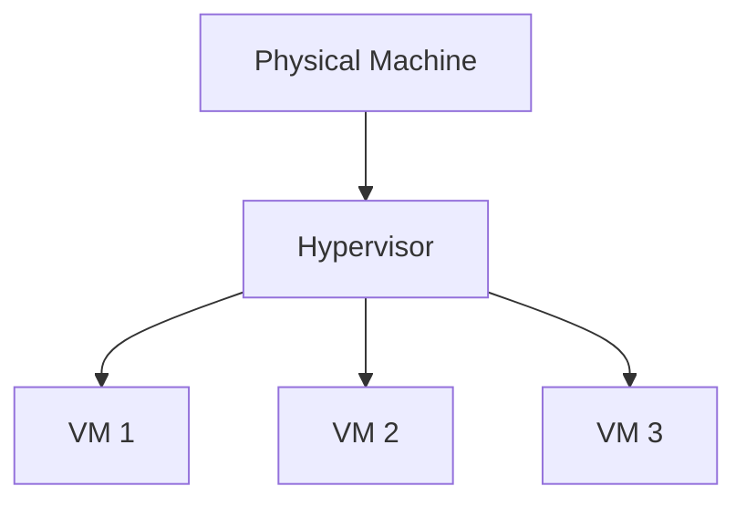
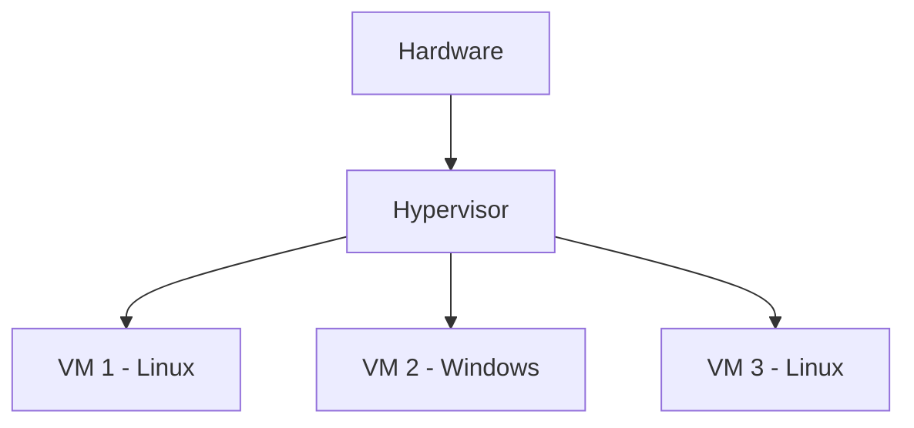
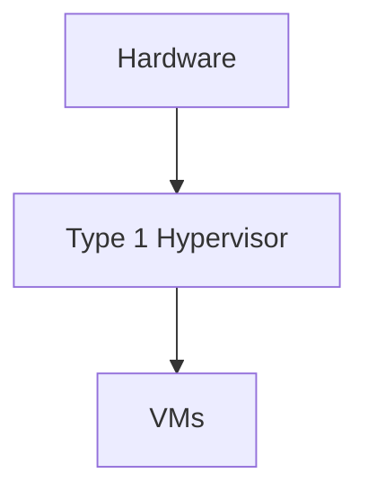
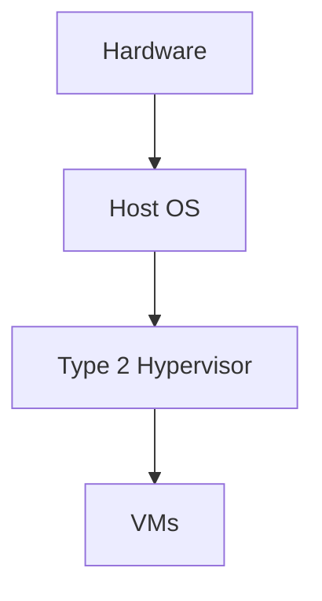
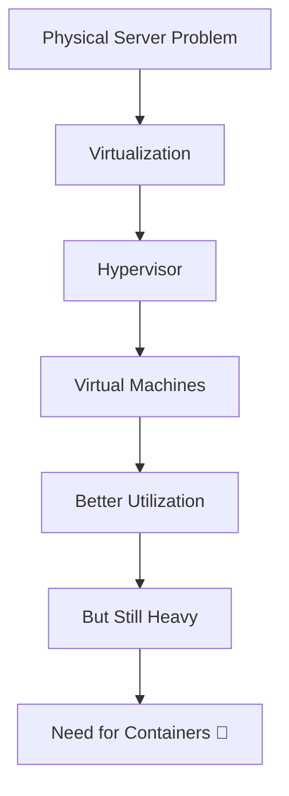

# 🐳 1.2 Virtualization

---

# 🏢 Physical Servers

Before virtualization, applications ran directly on physical machines 🖥️.

---

## ⚙️ Problem with Physical Servers

- One OS per machine
- Low hardware utilization
- Difficult scaling
- Expensive infrastructure 💸

---

## 📊 Traditional Setup

👉 One machine = One application (wasteful)

---

# ⚙️ What is Virtualization?

Virtualization is a technique that allows **multiple virtual machines to run on a single physical machine**.

👉 It improves hardware utilization and flexibility.

---

## 🧠 Core Idea

---

# 🧠 Hypervisors

A **Hypervisor ⚙️** is software that creates and manages Virtual Machines (VMs).

It allows multiple operating systems to run on the same hardware.

---

# 💻 Virtual Machines (VMs)

A Virtual Machine is a **software-based computer** that behaves like a real computer.

---

## 📦 Each VM has:

- Own OS 🖥️
- Own kernel 🧠
- Own memory & CPU allocation ⚙️
- Fully isolated environment 🔒

---

## 📊 VM Architecture

---

# 🔢 Types of Hypervisors

---

## 🟢 Type 1 Hypervisor (Bare Metal)

Runs directly on hardware 🖥️

### Examples:
- VMware ESXi
- Microsoft Hyper-V
- Xen

### 📊 Structure:

### ✅ Advantages:
- High performance ⚡
- Secure 🔒
- Direct hardware access

---

## 🔵 Type 2 Hypervisor (Hosted)

Runs on top of an operating system 💻

### Examples:
- VirtualBox
- VMware Workstation

### 📊 Structure:

### ❌ Limitations:
- Slower than Type 1
- Extra OS overhead

---

# ✅ Advantages of Virtualization

- 🧠 Better resource utilization
- 💰 Cost savings
- 🔒 Strong isolation
- ⚙️ Multiple OS on same machine
- 📦 Easy backup and recovery

---

# ❌ Limitations of Virtualization

- 🪨 Heavy (each VM has full OS)
- ⏳ Slow boot time
- 💾 High memory usage
- ⚡ Lower performance compared to containers

---

# 🧠 Key Insight

👉 Virtualization = Multiple OS on same hardware  
👉 But each OS is heavy and resource-consuming

---

# 📚 Summary

Virtualization solves physical server limitations by introducing hypervisors and virtual machines.

However, VMs are still heavy, which later leads to the need for **containers (Docker)**.

---

# 🎯 Final Flow

---