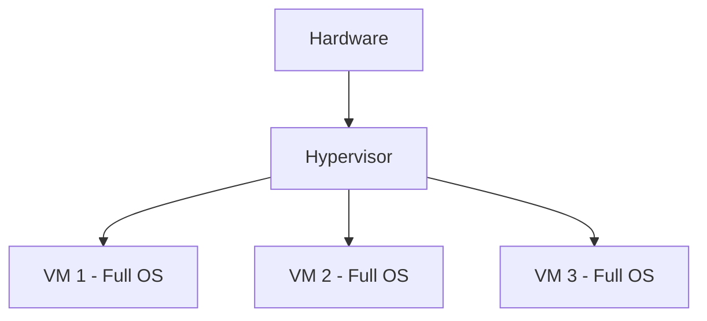
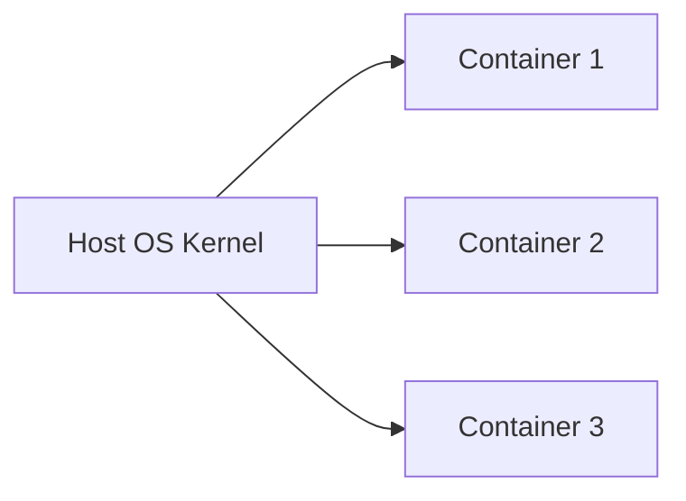
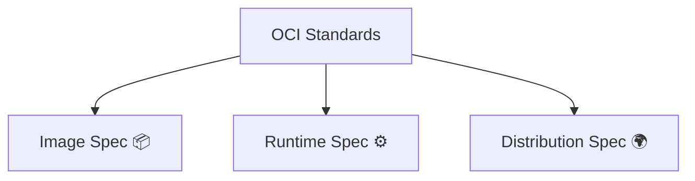
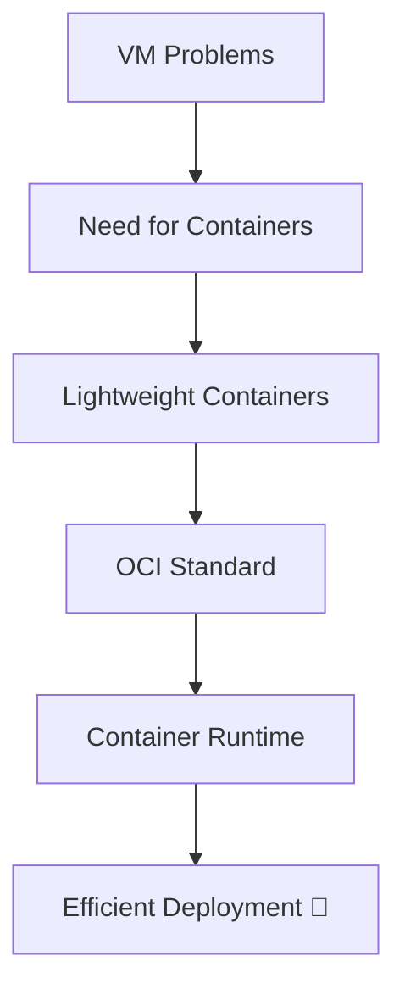

# 🐳 1.3 Why Containers?

---

# ❌ Problems with Virtual Machines (VMs)

Although VMs solved physical server issues, they still have limitations.

---

## 🪨 1. Heavy Weight

Each VM includes:

- Full OS 🖥️
- System libraries 📚
- Kernel 🧠

👉 This makes VMs very heavy.

---

## ⏳ 2. Slow Startup

- VM boot = minutes ⏱️  
- Requires full OS startup

---

## 💾 3. High Resource Usage

- Each VM consumes RAM, CPU, storage heavily
- Less efficient scaling

---

## 📊 VM Problem View

👉 Too much duplication of OS

---

# 🚀 What are Containers?

Containers are a **lightweight alternative to Virtual Machines**.

They run applications in isolated environments but **share the host OS kernel**.

---

## 🧠 Core Idea

👉 No full OS inside each container

---

## 📦 Container Features

- Lightweight ⚡
- Fast startup 🚀
- Isolated environments 🔒
- Share OS kernel 🧠

---

# ⚙️ OCI (Open Container Initiative)

OCI is an industry standard that defines how containers should work.

---

## 🎯 Why OCI exists?

Before OCI:
- Different container formats
- No compatibility standard

After OCI:
- Standardized container format 📦
- Portable across systems 🌍
- Works with any OCI-compliant runtime

---

## 📊 OCI Structure

---

# ⚙️ Container Runtime

A **Container Runtime** is responsible for running containers.

It interacts directly with the OS to execute containers.

---

## 🧠 What it does

- Runs containers 🚀
- Manages lifecycle (start/stop)
- Handles isolation 🔒
- Allocates resources ⚙️

---

## 🔧 Examples of Container Runtimes

- containerd
- CRI-O
- runc

---

## 📊 Runtime Flow

---

# 🧠 Key Insight

👉 Containers solve VM problems by removing full OS duplication  
👉 They rely on shared kernel + lightweight isolation

---

# 📚 Summary

Containers were created to overcome VM limitations:

- VMs are heavy and slow 🪨
- Containers are lightweight and fast ⚡
- OCI provides standardization 📦
- Container runtime executes containers ⚙️

---

# 🎯 Final Flow

---