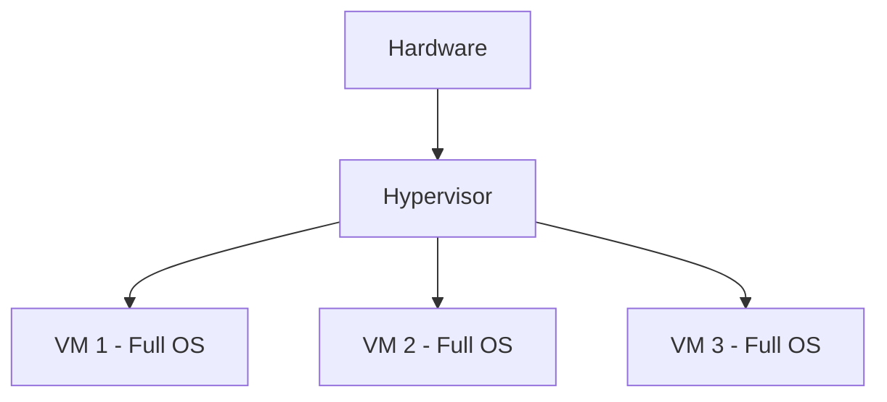
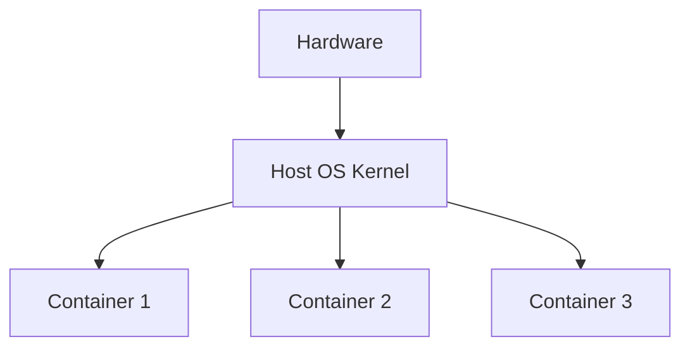
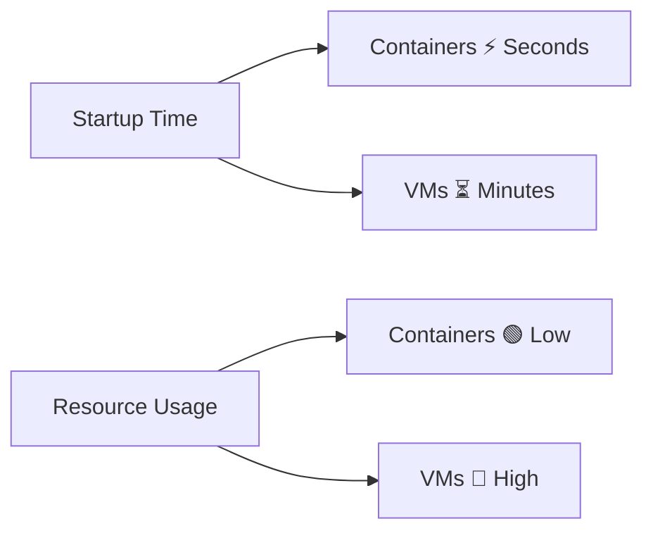
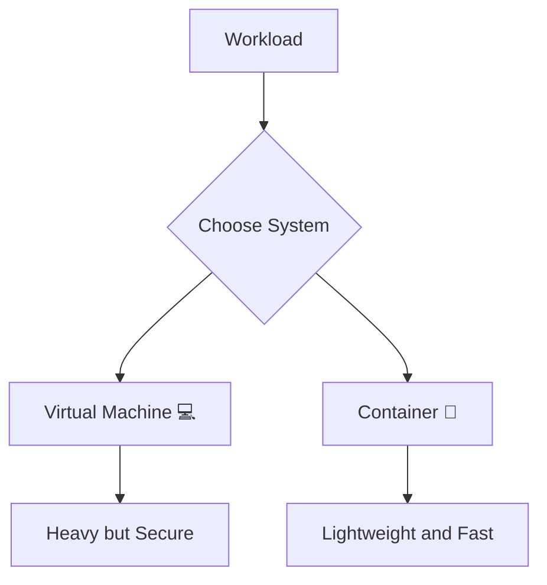
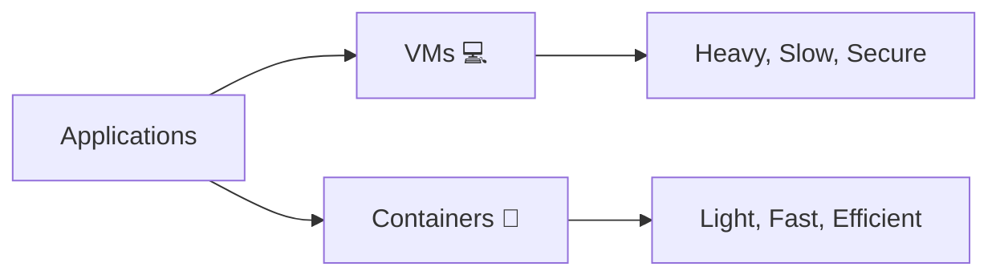

# 🐳 1.4 Containers vs Virtual Machines

---

# ⚖️ Core Idea

Both **Containers 🐳** and **Virtual Machines 💻** are used to run applications in isolated environments.

But they work in completely different ways.

---

## 🧠 Simple Analogy

- 💻 VM = Full house (with everything inside 🏠)
- 🐳 Container = Apartment in a building (shares infrastructure 🏢)

---

# 🏗️ Architecture Difference

---

## 💻 Virtual Machines

👉 Each VM has its own OS

---

## 🐳 Containers

👉 Containers share the host OS kernel

---

# ⚖️ Containers vs Virtual Machines

| Feature | 🐳 Containers | 💻 Virtual Machines |
|--------|--------------|---------------------|
| OS | Share host OS | Full OS per VM |
| Size | Lightweight ⚡ | Heavy 🪨 |
| Startup Time | Seconds 🚀 | Minutes ⏳ |
| Performance | High ⚡ | Medium |
| Isolation | Process-level | Hardware-level |
| Resource Usage | Efficient | High |
| Portability | Very high 🌍 | Moderate |

---

# 🚀 Performance Comparison

---

# 🔐 Isolation Difference

---

## 💻 Virtual Machines

- Strong isolation 🔒
- Separate OS per VM
- Safer but heavy

---

## 🐳 Containers

- Process-level isolation
- Shares kernel
- Lightweight but slightly less isolated than VMs

---

# ⚙️ Use Cases

---

## 💻 Virtual Machines are used for:

- Running different operating systems 🖥️
- Legacy applications
- Strong security isolation environments

---

## 🐳 Containers are used for:

- Microservices architecture 🚀
- Cloud-native apps ☁️
- CI/CD pipelines 🔁
- Fast scaling systems ⚡

---

# 🧠 Key Insight

👉 VMs = Isolation + Heavy  
👉 Containers = Lightweight + Fast

---

# 📊 Visual Summary

---

# 📚 Summary

- VMs provide full OS isolation but are heavy 🪨
- Containers share OS kernel and are lightweight ⚡
- Containers are faster, scalable, and cloud-friendly 🌍
- VMs are better for strong isolation and multi-OS needs 💻

---

# 🎯 Final Flow

---