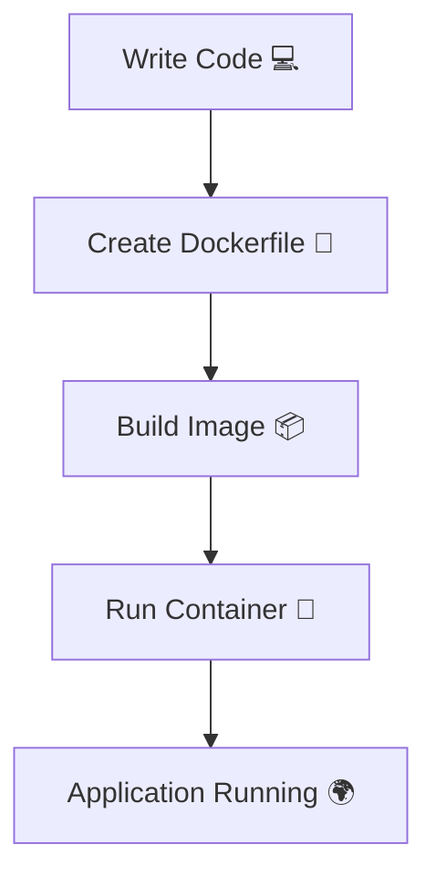
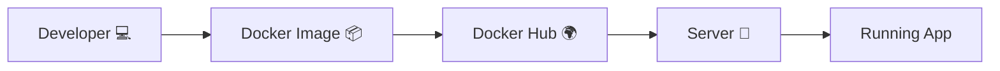
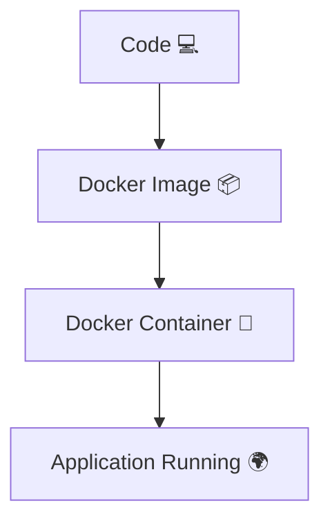

# 🐳 1.5 What is Docker?

---

# 📖 Introduction

**Docker 🐳** is a platform that helps you:

- 📦 Build applications as images
- 🚀 Run applications as containers
- 🌍 Share applications easily across systems

👉 It solves the problem of “it works on my machine” by packaging everything together.

---

# 🧠 Core Idea


👉 Docker = Build + Ship + Run

---

# ⚙️ What Docker Actually Does

Docker takes your application and bundles:

- Code 💻
- Libraries 📚
- Dependencies 📦
- Configuration ⚙️

into a single **Docker Image 📦**

---

# 🚀 Docker Workflow



---

# 📦 Key Concepts in Docker

---

## 🧱 1. Docker Image

- Blueprint 📐
- Read-only 📦
- Used to create containers

---

## 🚀 2. Docker Container

- Running instance of image
- Lightweight process
- Isolated environment

---

## ⚙️ 3. Docker Engine

- Core system that runs Docker
- Manages containers and images

---

# 🌍 Why Docker is Popular?

---

## ⚡ 1. Portability

Runs anywhere:

- Windows 🪟
- Linux 🐧
- Mac 🍎
- Cloud ☁️

---

## 🚀 2. Fast Deployment

- Starts in seconds
- No OS boot required

---

## 🔒 3. Isolation

Each container runs independently.

---

## 🔁 4. Reusability

Same image → multiple containers

---

# 🧠 Simple Analogy

- 📦 Image = Recipe
- 🚀 Container = Dish
- 👨‍🍳 Docker = Chef

```text
Recipe (Image) → Cooking → Dish (Container)
```

---

# 📊 Docker in Real Life



---

# ⚖️ Docker vs Traditional Deployment

| Feature | 🐳 Docker | 🖥️ Traditional |
|--------|----------|---------------|
| Setup | Fast ⚡ | Slow 🐢 |
| Environment | Consistent 🌍 | Different everywhere |
| Portability | High | Low |
| Deployment | Easy 🚀 | Complex |

---

# 🧠 Key Insight

👉 Docker removes environment differences  
👉 It ensures same app runs everywhere

---

# 📚 Summary

Docker is a platform that:

- Packages applications into images 📦
- Runs them as containers 🚀
- Ensures consistency across environments 🌍
- Simplifies deployment and scaling ⚡

---

# 🎯 Final Flow



---