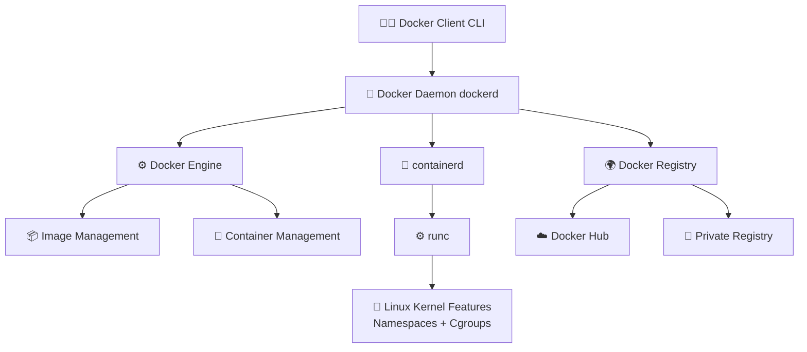
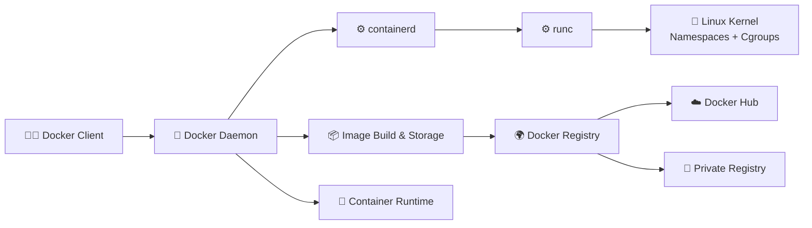
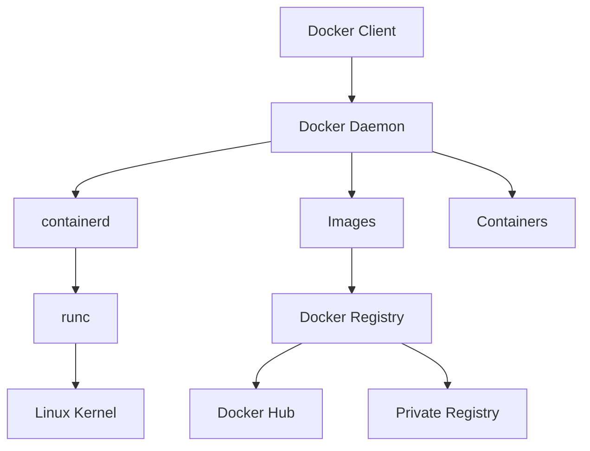

# 🐳 1.6 Docker Architecture — Complete Overview

---

# 🧠 What is Docker Architecture?

Docker Architecture defines how different components of Docker work together to:

- 📦 Build images  
- 🚀 Run containers  
- 🌍 Share images  
- ⚙️ Manage lifecycle  

---

# 🏗️ High-Level Docker Architecture

👉 This is the **complete end-to-end flow** of Docker:



---

# 💻 1. Docker Client

The **Docker Client 🧑‍💻** is where users interact with Docker.

---

## 📌 What it does

- Sends commands to Docker daemon
- Uses CLI (`docker run`, `docker build`)
- Acts as user interface

---

## 🧾 Example

```bash
docker run nginx
```

👉 This command goes to Docker Daemon

---

# ⚙️ 2. Docker Daemon (dockerd)

The **Docker Daemon 🧠** is the core background service.

---

## 📌 Responsibilities

- Builds images 📦
- Runs containers 🚀
- Manages networks 🌐
- Handles storage 💾

---

# 🧱 3. Docker Engine

Docker Engine is the **core system** that includes:

- Docker Daemon
- REST API
- CLI interaction layer

👉 It connects everything together

---

# 📦 4. containerd

**containerd ⚙️** is a high-level container runtime.

---

## 📌 Responsibilities

- Pulls images 📥
- Manages container lifecycle 🚀
- Handles storage & execution

👉 It is lightweight and stable

---

# ⚙️ 5. runc

**runc 🧩** is the low-level runtime.

---

## 📌 Responsibilities

- Actually creates containers
- Uses Linux kernel features
- Runs processes inside containers

---

## 🧠 Key Tech Used:

- Namespaces 🔒 (isolation)
- Cgroups 📊 (resource control)

---

# 🌍 6. Docker Registry

A **Docker Registry 📡** is a storage system for Docker images.

---

## 📌 What it does

- Stores images 📦
- Distributes images 🌍
- Version control using tags

---

# ☁️ 7. Docker Hub

**Docker Hub ☁️** is the default public registry.

---

## 📌 Features

- Official images 📦
- Public sharing 🌍
- Private repositories 🔒
- Community images 👥

---

## 🧾 Example

```bash
docker pull nginx
```

👉 Comes from Docker Hub by default

---

# 🏢 8. Private Registry

Used in companies for internal images.

---

## 📌 Why?

- Security 🔒
- Internal apps 🏢
- Controlled access 👤

---

# 🔄 End-to-End Docker Flow



---

# 🧠 Key Insight

👉 Docker is not one tool  
👉 It is a **system of multiple components working together**

---

# 📚 Summary

Docker Architecture consists of:

- 🧑‍💻 Client → sends commands  
- 🐳 Daemon → processes commands  
- ⚙️ containerd → manages containers  
- 🧩 runc → runs containers using OS kernel  
- 🌍 Registry → stores images  
- ☁️ Docker Hub → public image store  

---

# 🎯 Final Flow



---