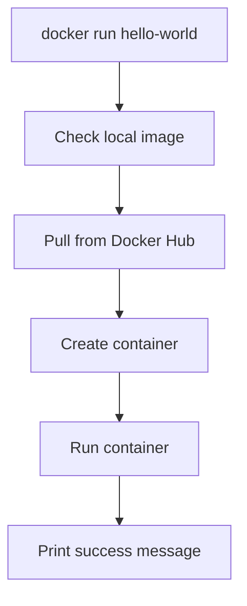

# 🐳 02. Docker Installation (Ubuntu Linux) — Complete Guide

---

# 📖 What is Docker Installation?

Docker installation is the process of setting up **Docker Engine 🐳** on your Ubuntu system so you can run containers.

After installation you get:

- ⚙️ Docker Engine (runs containers)
- 💻 Docker CLI (commands)
- 🔄 Docker Daemon (background service)

---

# 🐧 Step-by-Step Docker Installation (Ubuntu)

---

# 🔄 1. Update System Packages

## 🧾 Syntax

```bash
sudo apt update
```

## ❓ What it does

👉 Refreshes package list so Ubuntu knows latest software versions.

---

# 📦 2. Install Required Dependencies

## 🧾 Syntax

```bash
sudo apt install -y ca-certificates curl gnupg lsb-release
```

## ❓ Why?

👉 These tools are needed to securely download Docker.

---

# 🔐 3. Add Docker GPG Key

## 🧾 Syntax

```bash
sudo mkdir -p /etc/apt/keyrings

curl -fsSL https://download.docker.com/linux/ubuntu/gpg | \
sudo gpg --dearmor -o /etc/apt/keyrings/docker.gpg
```

## ❓ What it does

👉 Adds Docker’s official security key to verify packages.

---

# 📡 4. Add Docker Repository

## 🧾 Syntax

```bash
echo \
"deb [arch=$(dpkg --print-architecture) signed-by=/etc/apt/keyrings/docker.gpg] \
https://download.docker.com/linux/ubuntu \
$(lsb_release -cs) stable" | \
sudo tee /etc/apt/sources.list.d/docker.list > /dev/null
```

## ❓ What it does

👉 Tells Ubuntu where to download Docker from.

---

# 🔄 5. Update Package Index Again

## 🧾 Syntax

```bash
sudo apt update
```

## ❓ Why again?

👉 Now Ubuntu includes Docker repository.

---

# 🐳 6. Install Docker Engine

## 🧾 Syntax

```bash
sudo apt install -y docker-ce docker-ce-cli containerd.io docker-buildx-plugin docker-compose-plugin
```

## ❓ What it installs

- docker-ce → Docker Engine
- docker-ce-cli → Docker commands
- containerd → container runtime
- buildx → build images
- compose plugin → multi-container support

---

# ▶️ 7. Start Docker Service

## 🧾 Syntax

```bash
sudo systemctl start docker
```

---

# 🔁 8. Enable Docker on Boot

## 🧾 Syntax

```bash
sudo systemctl enable docker
```

---

# 👤 9. (Optional) Run Docker Without Sudo

## 🧾 Syntax

```bash
sudo usermod -aG docker $USER
```

👉 Then restart session:

```bash
newgrp docker
```

---

# 🔍 10. Verify Docker Installation

## 🧾 Syntax

```bash
docker --version
```

---

## 🧪 Output Example

```text
Docker version 25.0.0, build abc123
```

---

# 📊 11. Check Docker System Info

## 🧾 Syntax

```bash
docker info
```

---

## ❓ What it shows

- Containers
- Images
- Storage driver
- Docker root directory
- System details

---

# 👋 12. Run Hello World Container (FINAL TEST)

## 🧾 Syntax

```bash
docker run hello-world
```

---

## ❓ What it does

👉 This is a test container to confirm Docker works correctly.

---

## 📊 Flow



---

## 🧪 Output Example

```text
Hello from Docker!
This message shows that your installation appears to be working correctly.
```

---

# ⚠️ Common Issues

---

## ❌ Permission Denied

```text
Got permission denied while trying to connect to Docker daemon
```

### ✔ Fix:

```bash
sudo usermod -aG docker $USER
newgrp docker
```

---

## ❌ Docker service not running

### ✔ Fix:

```bash
sudo systemctl start docker
```

---

# 🎯 Final Installation Flow


---

# 📌 Key Takeaways

- 🐧 Ubuntu uses apt-based Docker installation
- 🔐 GPG key ensures secure installation
- 📡 Docker repo is required for latest version
- ⚙️ systemctl manages Docker service
- 👋 hello-world confirms installation success

---

# 📚 Summary

Docker installation on Ubuntu involves setting up repository, installing engine, starting service, and verifying using `hello-world` container.

Once done, your system is ready for building and running containers 🚀

---