# 🐳 Docker Image 🌟

---

## 📖 Introduction and Core Concept

A **Docker Image** 🧱 is a **read-only (immutable) template** that contains everything needed to run an application.

It includes:

- 🧑‍💻 Application code  
- ⚙️ Runtime  
- 📚 Libraries  
- 📦 Dependencies  
- 🧾 Configuration files  

---

### 🌍 Why Docker Images?

Docker Images provide a **consistent environment** across:


👉 Same image → Same behavior everywhere

---

### 🧠 Core Idea

A Docker Image acts as a **blueprint 🧾** for creating Docker Containers 🚀.

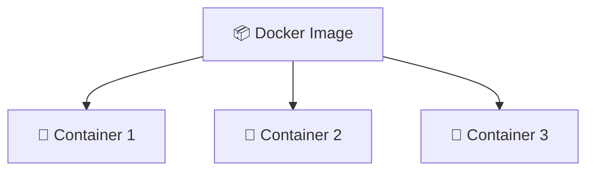

✔ One Image → Many Containers

---

### ⚡ Key Characteristics

- 📦 **Read-only (Immutable)**  
- 🚀 Used to create Docker Containers  
- 🔄 Reusable multiple times  
- 🌍 Portable across systems  
- 📁 Stored locally after download  
- ☁️ Shared via Docker registries (like Docker Hub)  

---

> ⚠️ **Important Note:**  
Docker Images cannot be modified.  
If changes are needed → create a new image 🆕

---

## 🎂 Real-Life Example

Think of a **cake recipe 🍰**

| Concept | Real World | Docker |
|--------|------------|--------|
| 📝 Recipe | Instructions | Docker Image |
| 👨‍🍳 Baking | Process | Container creation |
| 🎂 Cake | Final product | Running Container |

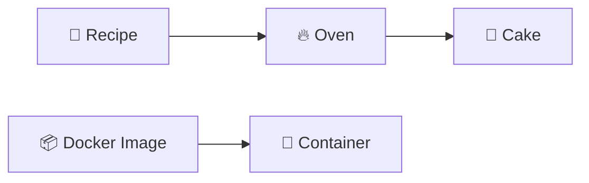

---

## 🏷️ Docker Image Naming

Every Docker image is identified using:

```text
repository:tag
```

---

### 📌 Examples

```text
nginx:latest
ubuntu:22.04
node:20
myapp:v1
john/myapp:v2
```

---

### 🧠 Breakdown

| Component | Meaning |
|------------|--------|
| 📦 Repository | Image name |
| 🏷️ Tag | Version of image |

---

### ⚠️ Default Behavior

If no tag is given:

```bash
docker pull nginx
```

👉 Docker assumes:

```bash
nginx:latest
```

---

## ☁️ Docker Hub (Registry 🌍)

Docker Hub is the **default public registry ☁️** where Docker images are stored and shared.

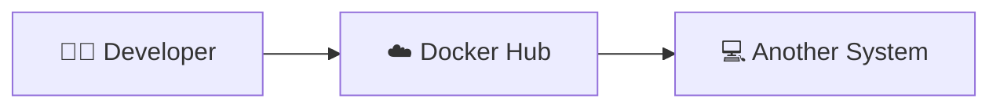

---

### 📌 What you can do

- 📥 Pull images  
- 📤 Push images  
- 🔍 Search official images  
- 🤝 Share with teams  

---

### 🧾 Popular Images

- 🐳 nginx  
- 🐧 ubuntu  
- 🟢 node  
- 🐬 mysql  
- 🔴 redis  

---

## ⚙️ Docker Image Commands

Each command follows:

```
👉 What → Syntax → Flags → Example → Explanation
```

---

# 1️⃣ 📥 docker pull

## ❓ What does it do?

Downloads an image from Docker Hub ☁️ to your local system 💻.

---

## 🧾 Syntax

```bash
docker pull <repository>:<tag>
```

---

## 🚩 Flags

| Flag | Meaning |
|------|--------|
| `--platform` | Choose system type |
| `-q` | Quiet mode |

---

## 🧪 Example

```bash
docker pull nginx:latest
```

---

## 📌 Flow

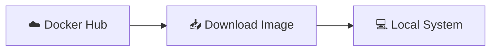

---

# 2️⃣ 📋 docker images

## ❓ What does it do?

Shows all images available locally 💻.

---

## 🧾 Syntax

```bash
docker images
```

---

## 🧪 Example Output

```text
REPOSITORY   TAG      IMAGE ID      SIZE
nginx        latest   abc123        192MB
ubuntu       22.04    xyz456        77MB
node         20       def789        1.1GB
```

---

## 📊 Visualization

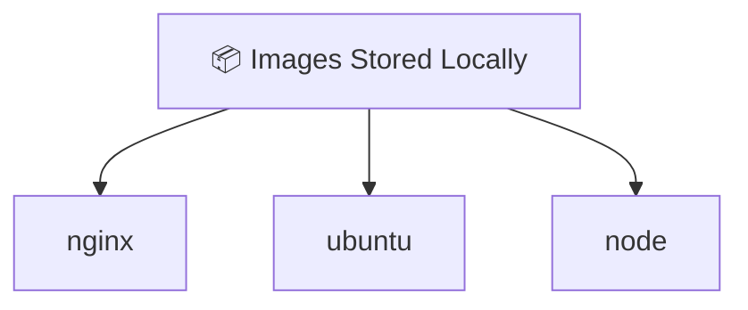

---

# 3️⃣ 🆕 docker image ls

## ❓ What does it do?

Same as `docker images` but newer and recommended version.

---

## 🧾 Syntax

```bash
docker image ls
```

---

## 🔁 Comparison

| Old Command | New Command |
|-------------|------------|
| docker images | docker image ls |

---

## 📌 Why use it?

- 🧹 Cleaner structure  
- 📚 Modern Docker standard  
- 📦 Groups image commands under `docker image`  

---

## 🧠 Flow

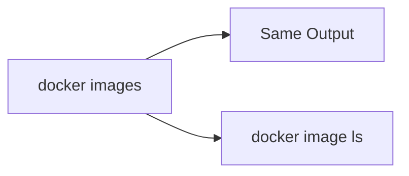

---

# 🎯 Summary of Part

- 🐳 Docker Image = Blueprint  
- 🚀 Container = Running instance  
- ☁️ Docker Hub = Image store  
- 📥 pull = Download images  
- 📋 images/ls = View images  
- 🏷️ tag = Versioning (next section later)  

---


# ⚙️ Docker Image Commands (Advanced Guide)

---

Each command follows:

```
👉 What → Syntax → Flags → Example → Explanation
```

---

# 4️⃣ 🔍 Inspect a Docker Image (`docker inspect`)

---

## ❓ What does this command do?

The `docker inspect` command displays **detailed metadata** about a Docker image in **JSON format 📄**.

---

## 📦 What it shows

- 🆔 Image ID  
- 📅 Creation date  
- 🐧 Operating system  
- 🧠 CPU architecture  
- ⚙️ Environment variables  
- 🏷️ Labels  
- 🧱 Image layers  
- 📦 Configuration details  

---

## 🧠 When to use it?

- Debugging issues 🐞  
- Understanding image structure 🧩  
- Checking configuration ⚙️  

---

## 🧾 Syntax

```bash
docker inspect <image-name>
```

---

## 🚩 Common Flags

| Flag | Meaning |
|------|--------|
| `--format` | Extract specific fields |
| `-f` | Short form of format |

---

## 🧪 Example

```bash
docker inspect nginx
```

---

## 🎯 Extract Only Image ID

```bash
docker inspect --format='{{.Id}}' nginx
```

---

## 📊 Flow Diagram

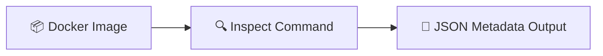

---

# 5️⃣ 🧱 View Image History (`docker history`)

---

## ❓ What does this command do?

The `docker history` command shows **all layers of a Docker image** 🧱.

---

## 🧠 Why layers matter?

Each instruction in image creation = one layer.

---

## 📊 Layer Concept

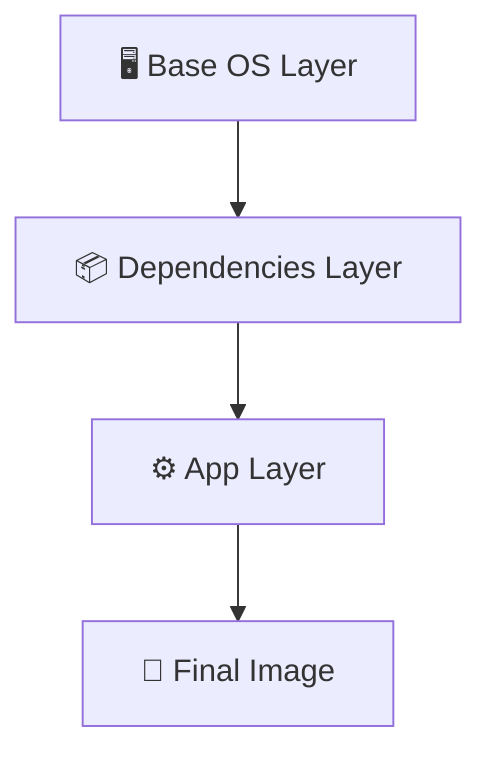

---

## 🧾 Syntax

```bash
docker history <image-name>
```

---

## 🚩 Flags

| Flag | Meaning |
|------|--------|
| `--no-trunc` | Show full output |
| `-q` | Show only layer IDs |

---

## 🧪 Example

```bash
docker history nginx
```

---

## 📦 Sample Output

```text
IMAGE          CREATED         CREATED BY                     SIZE
abc123         2 weeks ago     /bin/sh -c #(nop)...           0B
def456         2 weeks ago     COPY app /usr/src/app         15MB
ghi789         2 weeks ago     RUN apt-get install...        80MB
```

---

## 🎯 What you learn here

- 🧩 How image is built  
- 📉 Where size is coming from  
- ⚡ Optimization opportunities  

---

# 6️⃣ 🏷️ Tag (Rename) a Docker Image (`docker tag`)

---

## ❓ What does this command do?

The `docker tag` command creates a **new name (alias)** for an existing image.

👉 This is how Docker "renaming" works.

---

## ⚠️ Important Concept

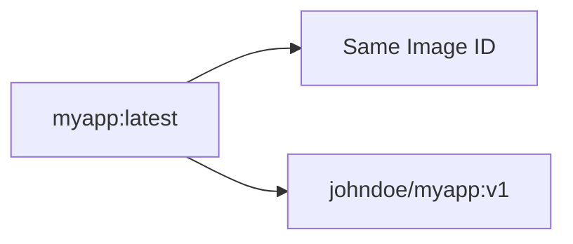

👉 No duplication happens  
👉 Only new reference is created

---

## 🧾 Syntax

```bash
docker tag <source-image>:<tag> <target-image>:<tag>
```

---

## 🧪 Example

```bash
docker tag myapp:latest johndoe/myapp:v1
```

---

## 📦 Before & After

```text
REPOSITORY        TAG      IMAGE ID
myapp             latest   abc123
johndoe/myapp     v1       abc123
```

---

## 🧠 Key Insight

- Same Image ID = Same image  
- Different names = Different references  

---

## 🗑️ Remove old tag

```bash
docker rmi myapp:latest
```

---

# 7️⃣ 🚀 Upload Image (`docker push`)

---

## ❓ What does this command do?

Uploads Docker image to a registry 🌍 (Docker Hub ☁️).

---

## 🔐 Prerequisite

```bash
docker login
```

---

## 🧾 Syntax

```bash
docker push <repository>:<tag>
```

---

## 🧪 Example

```bash
docker push johndoe/myapp:v1
```

---

## 📊 Flow Diagram

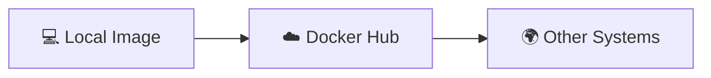

---

# 8️⃣ 💾 Save Image (`docker save`)

---

## ❓ What does this command do?

Exports Docker image into a **.tar file 📦**

---

## 🧾 Syntax

```bash
docker save -o <file>.tar <image>:<tag>
```

---

## 🧪 Example

```bash
docker save -o nginx.tar nginx:latest
```

---

## 📦 Flow

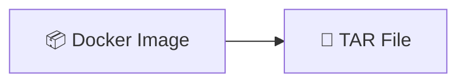

---

## 🎯 Use cases

- 💾 Backup  
- 📤 Offline sharing  
- 🧳 Migration  

---

# 📂 9️⃣ Load Image (`docker load`)

---

## ❓ What does this command do?

Imports image from a `.tar` file 📦

---

## 🧾 Syntax

```bash
docker load -i <file>.tar
```

---

## 🧪 Example

```bash
docker load -i nginx.tar
```

---

## 📊 Flow Diagram

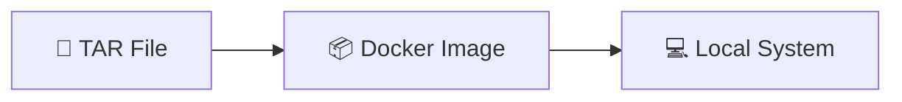

---

## 🔍 Verification

```bash
docker images
```

---

# 🎯 Final Command Flow (Visual Summary)

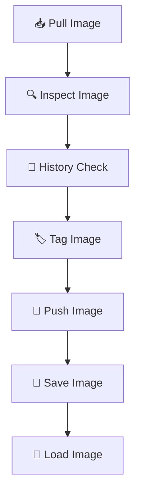

---

# 🧠 Quick Summary

| Command | Purpose |
|--------|--------|
| 🔍 inspect | View metadata |
| 🧱 history | View layers |
| 🏷️ tag | Rename/version |
| 🚀 push | Upload |
| 💾 save | Export |
| 📂 load | Import |

---


# 🧹 Docker Image Cleanup & Management

---

# 🔟 ❌ Remove a Docker Image (`docker rmi`)

---

## ❓ What does this command do?

The `docker rmi` command removes 🗑️ one or more Docker images from the local system 💻.

---

## 🎯 Why use it?

- 🧹 Free disk space  
- 🗑️ Remove unused images  
- ⚡ Clean development environment  

---

## 🧾 Syntax

```bash
docker rmi <image-name>:<tag>
```

---

## 🚩 Flags

| Flag | Meaning |
|------|--------|
| `-f` | Force remove image |
| `-a` | Remove multiple images |

---

## 🧪 Example

```bash
docker rmi nginx:latest
```

---

## ⚠️ Important Behavior

If the image is in use:

```bash
docker rmi nginx:latest
```

❌ Fails if container is using it

👉 Force remove:

```bash
docker rmi -f nginx:latest
```

---

## 📊 Flow

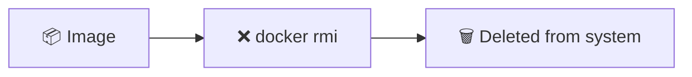

---

# 🧹 Remove Unused Images (`docker image prune`)

---

## ❓ What does this command do?

Removes unused or dangling images 🧽 that are not attached to any container.

---

## 🧠 Think of it like:

> 🧹 "Garbage collection for Docker images"

---

## 🧾 Syntax

```bash
docker image prune
```

---

## 🚩 Flags

| Flag | Meaning |
|------|--------|
| `-a` | Remove ALL unused images |
| `-f` | Skip confirmation |

---

## 🧪 Example

```bash
docker image prune -a
```

---

## 📊 Visualization

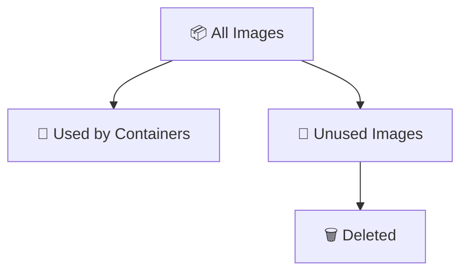

---

# 🌍 Real-World Docker Image Workflow

---

## 🧪 Full Developer Workflow

```bash
docker pull node:20
docker images
docker inspect node:20
docker history node:20
docker tag node:20 mynodeapp:v1
docker login
docker push user/mynodeapp:v1
docker save -o node.tar node:20
docker load -i node.tar
docker rmi node:20
docker image prune -a
```

---

## 🔁 Workflow Diagram

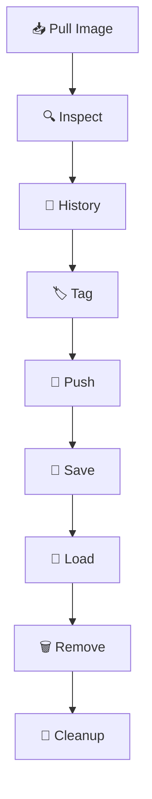

---

# ✨ Benefits of Docker Images

---

- 🚀 Fast deployment  
- 📦 Portable across systems  
- 🔄 Reusable templates  
- 🌍 Easy sharing via Docker Hub  
- ⚡ No manual setup needed  
- 🔒 Consistent environments  
- 📈 Version control via tags  

---

# ⚠️ Important Points

---

- 📦 Images are **immutable (read-only)**  
- 🚀 Containers are created from images  
- 🏷️ Images use `repository:tag` format  
- 🧭 `latest` is default tag  
- 🧩 `docker tag` = new reference, not new image  
- 🔗 One image → multiple containers  
- 🗑️ Removing one tag does NOT remove image if others exist  

---

# 📌 Key Takeaways

---

- 📥 `docker pull` → Download images  
- 📋 `docker images` → List images  
- 🔍 `docker inspect` → View metadata  
- 🧱 `docker history` → View layers  
- 🏷️ `docker tag` → Rename/version images  
- 🚀 `docker push` → Upload images  
- 💾 `docker save` → Backup images  
- 📂 `docker load` → Restore images  
- ❌ `docker rmi` → Remove images  
- 🧹 `docker image prune` → Cleanup system  

---

# 📚 Summary

---

A Docker Image is a **portable, reusable, immutable blueprint** for running applications.

---

## 🧭 Complete Lifecycle


---

## 🎯 Final Understanding

Docker Images enable:

- ⚡ Fast deployment  
- 🌍 Cross-platform consistency  
- 🔁 Reusability  
- 📦 Easy distribution  
- 🧩 Scalable architecture  

---