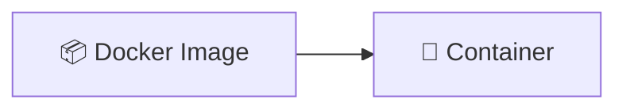
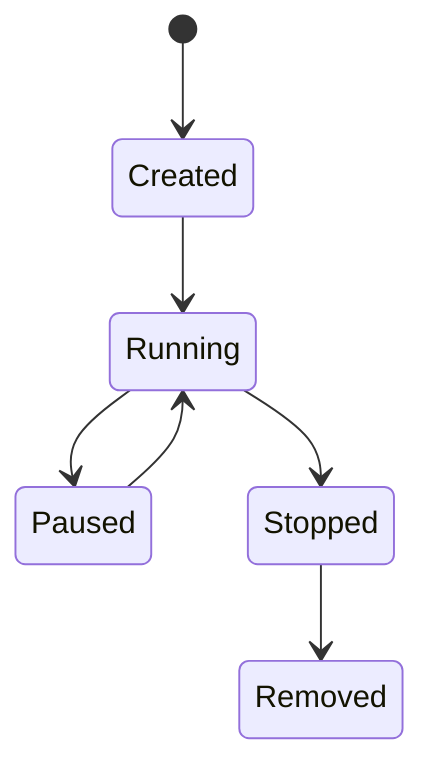
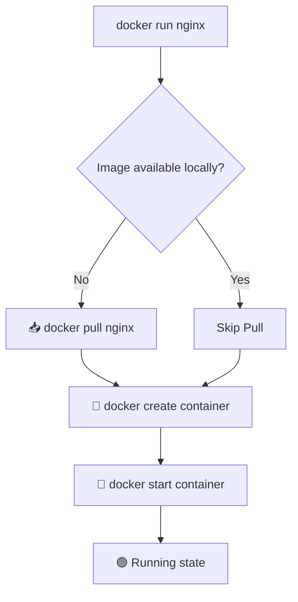
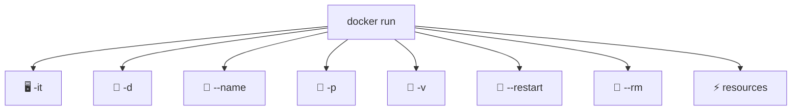
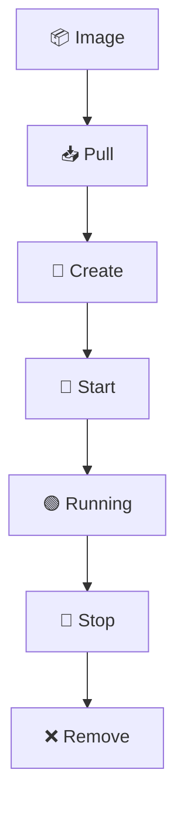
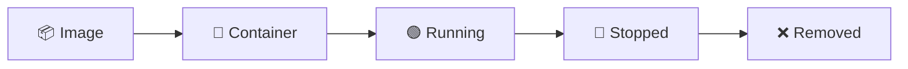

# 🐳 04. Docker Containers — Complete Guide

---

# 📖 What is a Docker Container?

A **Docker Container 🚀** is a **running instance of a Docker Image 📦**.

👉 Image = Blueprint  
👉 Container = Running Application  

---

# 🧠 Core Idea



👉 One Image → Multiple Containers

---

# ⚖️ Image vs Container

| Feature | 📦 Image | 🚀 Container |
|--------|--------|-------------|
| Type | Blueprint | Running instance |
| State | Static | Dynamic |
| Execution | No | Yes |
| Modifiable | No (immutable) | Yes (runtime) |

---

# 🔄 Container Lifecycle



---

# ⚙️ WHAT REALLY HAPPENS IN `docker run`

When you run:

```bash
docker run nginx
```

Docker internally performs:



---

## 🔥 Internal Breakdown

```text
docker run = pull + create + start
```

---

# 🚩 Docker Run FLAGS (IMPORTANT)

Flags define container behavior at runtime.

---

## ⚙️ Syntax

```bash
docker run [OPTIONS] IMAGE
```

---

# 🧠 1. Execution Flags

## 🖥️ `-it` → Interactive Mode

```bash
docker run -it ubuntu bash
```

👉 Interactive terminal inside container

---

## 🔄 `-d` → Detached Mode

```bash
docker run -d nginx
```

👉 Runs container in background

---

## 🧹 `--rm` → Auto Remove

```bash
docker run --rm nginx
```

👉 Deletes container after stop

---

# 🏷️ 2. Identity Flags

## 📛 `--name` → Container Name

```bash
docker run --name web nginx
```

---

# 🔁 3. Restart Policy Flags

```bash
docker run --restart always nginx
```

| Policy | Meaning |
|--------|--------|
| no | default |
| always | always restart |
| on-failure | restart on crash |
| unless-stopped | restart unless manually stopped |

---

# 🌐 4. Networking Flags

## 🔌 `-p` → Port Mapping

```bash
docker run -p 8080:80 nginx
```

👉 Access:
```
http://localhost:8080
```

---

## 🌍 `--network`

```bash
docker run --network mynetwork nginx
```

---

# 💾 5. Storage Flags

## 📂 `-v` → Volume Mount

```bash
docker run -v /host/data:/container/data nginx
```

---

# ⚡ 6. Resource Flags

## 🧠 `--memory`

```bash
docker run --memory="512m" nginx
```

## 🧮 `--cpus`

```bash
docker run --cpus="1.5" nginx
```

---

# 📊 FLAGS OVERVIEW



---

# ⚙️ CORE CONTAINER COMMANDS (ORDERED FLOW)

---

## 1️⃣ 🚀 docker run

```bash
docker run -d --name web -p 8080:80 nginx
```

👉 pull + create + start (all in one)

---

## 2️⃣ 📦 docker create

```bash
docker create nginx
```

👉 only creates container (not running)

---

## 3️⃣ ▶️ docker start

```bash
docker start web
```

👉 starts stopped container

---

## 4️⃣ 📋 docker ps

```bash
docker ps
```

All containers:

```bash
docker ps -a
```

---

## 5️⃣ 🛑 docker stop

```bash
docker stop web
```

👉 graceful stop

---

## 6️⃣ 💥 docker kill

```bash
docker kill web
```

👉 force stop immediately

---

## 7️⃣ 🔄 docker restart

```bash
docker restart web
```

---

## 8️⃣ 🧠 docker exec

```bash
docker exec -it web bash
```

👉 enter running container

---


---

## 9️⃣ 📜 docker logs

```bash
docker logs web
```

Live:

```bash
docker logs -f web
```

---

## 🔟 🔍 docker inspect

```bash
docker inspect web
```

👉 full container details (JSON)

---

## 1️⃣1️⃣ 📊 docker stats

```bash
docker stats
```

👉 real-time CPU & memory usage

---

## 1️⃣2️⃣ ❌ docker rm

```bash
docker rm web
```

Force:

```bash
docker rm -f web
```

---

# 🧹 CLEANUP COMMANDS

## Remove stopped containers

```bash
docker container prune
```

## Clean everything unused

```bash
docker system prune
```

---

# 🌍 REAL-WORLD WORKFLOW

```bash
docker pull nginx
docker run -d --name web -p 8080:80 nginx
docker ps
docker logs web
docker exec -it web bash
docker stats
docker stop web
docker rm web
docker system prune
```

---

# 📊 FULL LIFECYCLE FLOW



---

# ✨ BENEFITS OF CONTAINERS

- 🚀 Lightweight  
- ⚡ Fast startup  
- 🌍 Portable  
- 🔒 Isolated  
- 🔁 Scalable  
- 🧠 Consistent environments  

---

# ⚠️ IMPORTANT POINTS

- 📦 Containers come from images  
- 🚀 `docker run = pull + create + start`  
- 🧠 Containers are processes  
- ❌ Removing container ≠ removing image  
- 🔁 Restart policies control lifecycle  
- 🧹 Always clean unused containers  

---

# 📌 KEY TAKEAWAYS

- 📦 Image = Blueprint  
- 🚀 Container = Running instance  
- `docker run` → full automation  
- `docker create` → only create  
- `docker start` → run existing  
- `docker exec` → enter container  
- `docker logs` → debugging  
- `docker stop` → graceful stop  
- `docker kill` → force stop  
- `docker rm` → delete container  

---

# 📚 SUMMARY

Docker Containers are lightweight runtime environments created from images.

They enable:

- ⚡ Fast execution  
- 🌍 Portability  
- 🔁 Scalability  
- 🧠 Consistency  
- 🔒 Isolation  

---

# 🎯 FINAL FLOW



---