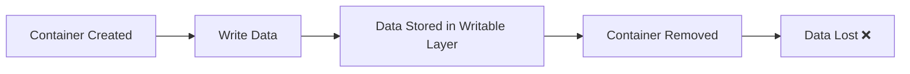
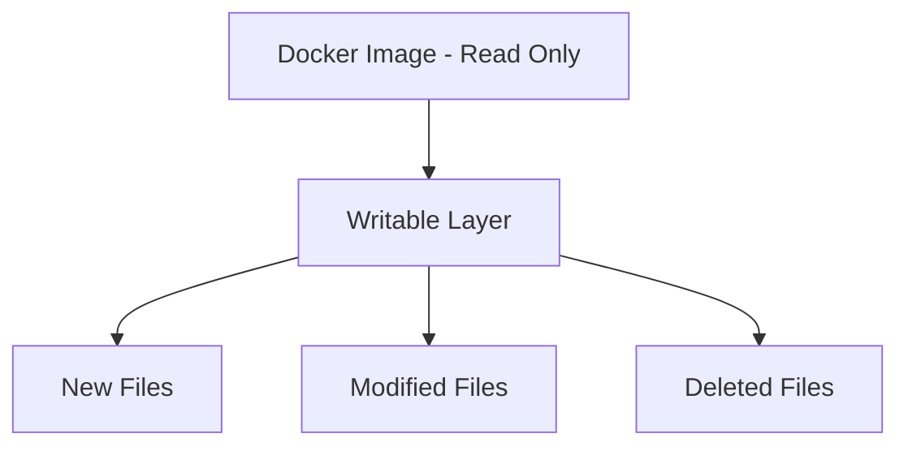
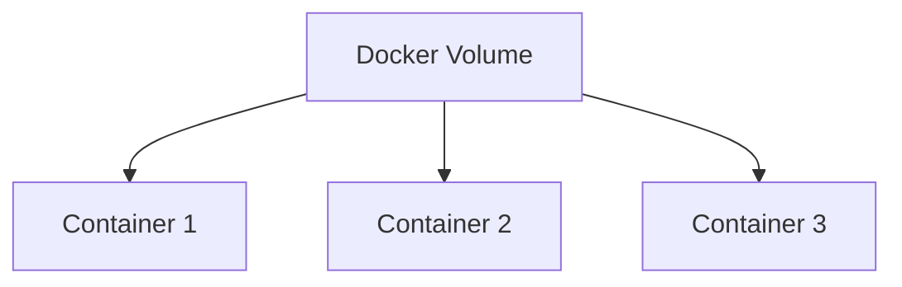
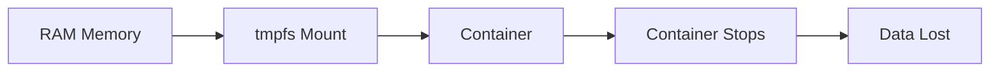
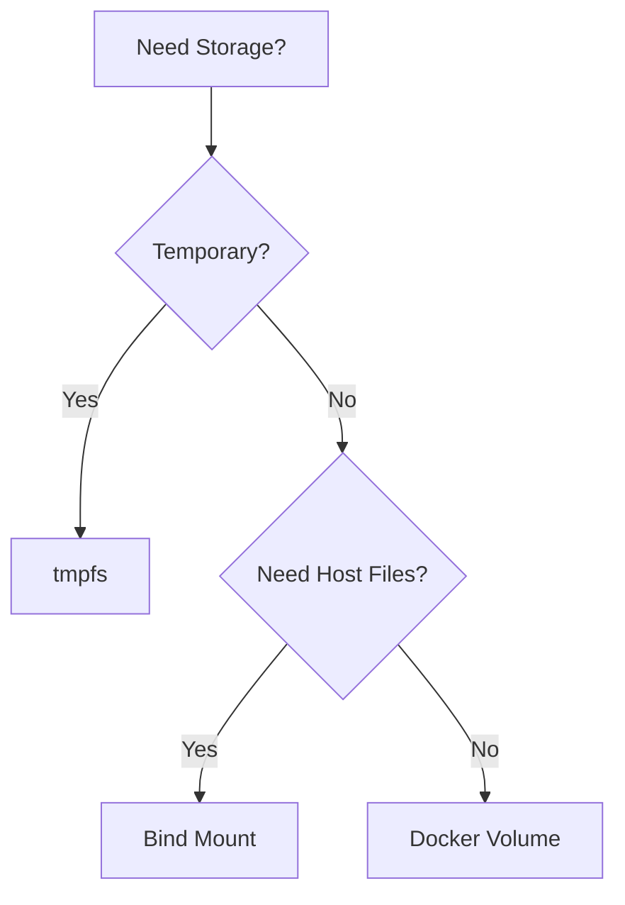
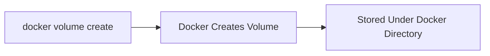
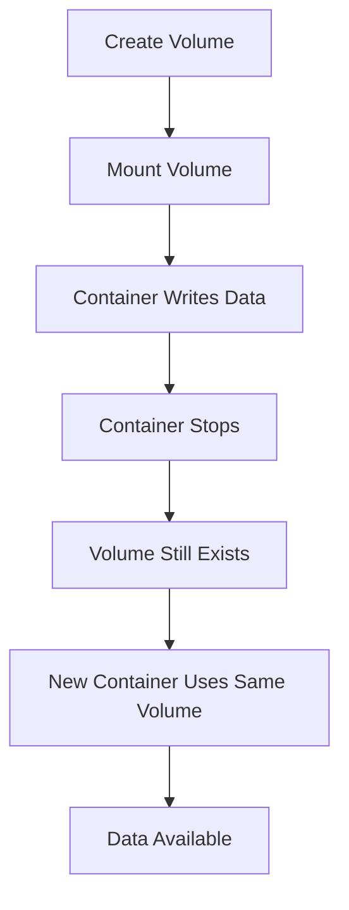
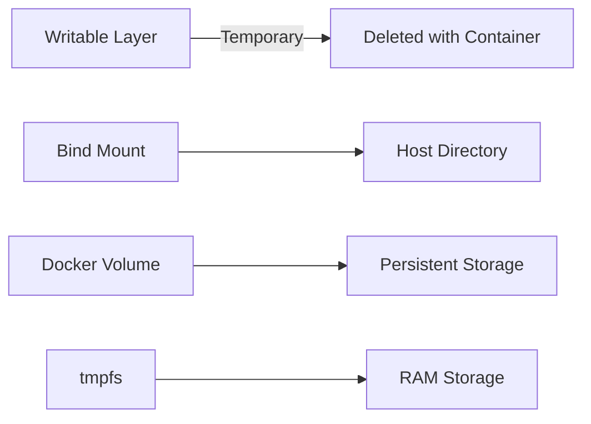

# 🐳 05. Docker Storage — Complete Guide

---

# 📖 What is Docker Storage?

Docker Storage is the mechanism used to **store and manage data** inside and outside containers.

By default, data created inside a container is stored in its **writable layer**, which is temporary. If the container is removed, the data is lost.

Docker provides different storage options to persist and share data:

- 📝 Writable Layer
- 📂 Bind Mounts
- 📦 Volumes
- ⚡ tmpfs Mounts

---

# ❓ Why Containers Lose Data?

Containers are designed to be **ephemeral (temporary)**.

When a container is deleted, everything stored inside its writable layer is also deleted.

Example:

```bash
docker run --name mycontainer ubuntu
```

Create a file inside the container:

```bash
echo "Docker Storage" > demo.txt
```

Exit the container and remove it:

```bash
docker rm mycontainer
```

The file is permanently lost because it existed only inside the container.

---

## 📊 Flow



---

# ✍️ Writable Layer

## 📖 What is Writable Layer?

Every Docker container has its own **Writable Layer**.

This is the top layer where all changes made by the running container are stored.

Examples:

- Creating files
- Editing files
- Installing software
- Writing logs

---

## 🧾 Example

Run a container:

```bash
docker run -it ubuntu bash
```

Create a file:

```bash
touch sample.txt
```

Verify:

```bash
ls
```

Output:

```text
sample.txt
```

Exit and remove the container:

```bash
exit

docker rm <container-id>
```

The file disappears because it was stored only in the writable layer.

---

## ✅ Characteristics

- Temporary
- Container-specific
- Deleted with container
- Fast to access

---

## 📊 Writable Layer Architecture



---

# 📂 Bind Mounts

## 📖 What is a Bind Mount?

A Bind Mount connects a **host machine directory** to a directory inside the container.

Both host and container access the same files.

---

## 🧾 Syntax

```bash
docker run -v <host-path>:<container-path> image
```

---

## 🧾 Example

```bash
docker run -it \
-v $(pwd):/app \
ubuntu bash
```

---

## ❓ What it does

Current directory on the host:

```text
/home/user/project
```

is mounted as

```text
/app
```

inside the container.

Any file created in either location appears in both.

---

## 🧪 Example

Inside container:

```bash
cd /app

touch docker.txt
```

On Host:

```bash
ls
```

Output:

```text
docker.txt
```

---

## ✅ Advantages

- Easy development
- Live file synchronization
- No copying required

---

## ⚠️ Disadvantages

- Depends on host directory structure
- Less portable
- Permission issues may occur

---

## 📊 Bind Mount Flow


---

# 📦 Docker Volumes

## 📖 What is a Docker Volume?

A Docker Volume is a **Docker-managed storage location** used to persist data independently of containers.

Volumes continue to exist even after containers are deleted.

---

## ❓ Why use Volumes?

Volumes are the recommended way to store:

- Database files
- Application uploads
- Configuration files
- Persistent application data

---

## 📊 Volume Architecture



---

## ✅ Advantages

- Persistent storage
- Easy backup
- Portable
- Faster than bind mounts
- Managed by Docker

---

## ⚠️ When to Use Volumes?

Use volumes when:

- Data must survive container removal
- Multiple containers share data
- Running databases
- Running production applications

---

# ⚡ tmpfs Mount

## 📖 What is tmpfs?

A tmpfs mount stores files **only in system memory (RAM).**

Nothing is written to disk.

When the container stops, all data disappears.

---

## 🧾 Syntax

```bash
docker run --tmpfs /app image
```

---

## 🧾 Example

```bash
docker run -it \
--tmpfs /cache \
ubuntu bash
```

---

Inside container:

```bash
cd /cache

touch temp.txt
```

The file exists only while the container is running.

---

## ✅ Advantages

- Extremely fast
- No disk writes
- Good for temporary files
- Improves security

---

## ⚠️ Limitations

- Data disappears after container stops
- Cannot be shared
- Uses RAM

---

## 📊 tmpfs Flow



---

# 📊 Comparison of Docker Storage Types

| Feature | Writable Layer | Bind Mount | Volume | tmpfs |
|----------|---------------|------------|--------|--------|
| Persistent | ❌ | ✅ | ✅ | ❌ |
| Docker Managed | ❌ | ❌ | ✅ | ✅ |
| Uses Host Files | ❌ | ✅ | ❌ | ❌ |
| Share Between Containers | ❌ | ✅ | ✅ | ❌ |
| Uses RAM | ❌ | ❌ | ❌ | ✅ |

---

# 🎯 Storage Selection Guide



---

# 📌 Key Takeaways

- Writable Layer is temporary.
- Removing a container removes writable layer data.
- Bind Mounts connect host directories to containers.
- Docker Volumes are the recommended persistent storage solution.
- tmpfs stores data in RAM and is ideal for temporary files.

---

# 📚 Summary

Docker provides multiple storage options depending on your use case.

- 📝 Writable Layer stores temporary container changes.
- 📂 Bind Mounts connect host directories with containers.
- 📦 Volumes provide persistent Docker-managed storage.
- ⚡ tmpfs stores temporary data in memory for high performance.

Choosing the correct storage option ensures your applications remain efficient, portable, and reliable.

---
# 📦 Create Docker Volumes

---

# 📖 What is a Docker Volume?

A Docker Volume is a **persistent storage area managed by Docker**.

Unlike the writable layer, volumes continue to exist even after a container is removed.

---

# 🆕 1. Create a Volume

## 🧾 Syntax

```bash
docker volume create <volume-name>
```

---

## 🧾 Example

```bash
docker volume create myvolume
```

---

## ❓ What it does

👉 Creates a Docker-managed volume named **myvolume**.

---

## 🧪 Output Example

```text
myvolume
```

---

# 📋 2. List Available Volumes

## 🧾 Syntax

```bash
docker volume ls
```

---

## 🧪 Output Example

```text
DRIVER    VOLUME NAME
local     myvolume
local     database-data
```

---

## ❓ What it shows

- Volume Driver
- Volume Name

---

# 🔍 3. Inspect a Volume

## 🧾 Syntax

```bash
docker volume inspect <volume-name>
```

---

## 🧾 Example

```bash
docker volume inspect myvolume
```

---

## 🧪 Output Example

```json
[
  {
    "Name": "myvolume",
    "Driver": "local",
    "Mountpoint": "/var/lib/docker/volumes/myvolume/_data"
  }
]
```

---

## ❓ What it shows

- Volume Name
- Driver
- Mount Location
- Labels
- Options

---

# 📊 Volume Creation Flow



---

# 🔗 Mount Docker Volumes

---

# 📖 What is Mounting?

Mounting means attaching a Docker volume to a directory inside a container.

The container can read and write data directly into the volume.

---

# 🧾 Syntax

```bash
docker run -v <volume-name>:<container-path> image
```

---

# 🧾 Example

```bash
docker run -it \
-v myvolume:/app \
ubuntu bash
```

---

## ❓ What it does

👉 Mounts **myvolume** to the **/app** directory inside the container.

Any files stored in `/app` are saved inside the Docker volume.

---

## 🧪 Example

Inside the container:

```bash
cd /app

touch notes.txt

echo "Docker Volume" > notes.txt
```

Exit the container.

Start another container using the same volume:

```bash
docker run -it \
-v myvolume:/app \
ubuntu bash
```

Check the files:

```bash
cd /app

ls
```

---

## 🧪 Output

```text
notes.txt
```

The file still exists because it was stored in the volume.

---

# 📊 Mount Volume Flow

```mermaid
flowchart LR
A[Docker Volume] --> B[/app]
B --> C[Container]
C --> D[Read & Write Data]
```

---

# 🤝 Share Volumes Between Containers

---

# 📖 What is Volume Sharing?

A single Docker volume can be mounted into multiple containers.

All containers can access the same data.

---

# 🧾 Example

Container 1

```bash
docker run -it \
--name app1 \
-v shared-volume:/data \
ubuntu bash
```

Create a file:

```bash
echo "Hello Docker" > /data/demo.txt
```

Exit the container.

---

Container 2

```bash
docker run -it \
--name app2 \
-v shared-volume:/data \
ubuntu bash
```

View the file:

```bash
cat /data/demo.txt
```

---

## 🧪 Output

```text
Hello Docker
```

---

## ❓ What happened?

Both containers are connected to the same Docker volume.

Changes made by one container are immediately available to the other.

---

# 📊 Shared Volume Architecture


---

# 🗑️ Remove a Volume

---

## 🧾 Syntax

```bash
docker volume rm <volume-name>
```

---

## 🧾 Example

```bash
docker volume rm myvolume
```

---

## ❓ What it does

Deletes the specified Docker volume.

---

## ⚠️ Note

A volume cannot be removed while it is being used by a running container.

---

# 🧹 Remove Unused Volumes

## 🧾 Syntax

```bash
docker volume prune
```

---

## ❓ What it does

Deletes all unused Docker volumes.

---

## 🧪 Confirmation

```text
WARNING! This will remove all local volumes not used by at least one container.
```

---

# 📊 Complete Storage Workflow



---

# ⚠️ Common Issues

---

## ❌ Volume Not Found

```text
Error response from daemon:
No such volume
```

### ✔ Fix

Create the volume first.

```bash
docker volume create myvolume
```

---

## ❌ Cannot Remove Volume

```text
volume is in use
```

### ✔ Fix

Stop and remove the containers using the volume.

```bash
docker stop <container-name>

docker rm <container-name>
```

Then remove the volume.

```bash
docker volume rm myvolume
```

---

## ❌ Mounted Directory Appears Empty

### ✔ Possible Reasons

- Wrong mount path
- Wrong volume name
- Mounted a new empty volume instead of the existing one

Verify using:

```bash
docker volume inspect myvolume
```

---

# 📊 Docker Storage Overview



---

# 📌 Key Takeaways

- 📦 Docker Volumes provide persistent storage.
- 🔗 A volume can be mounted into one or multiple containers.
- 🤝 Shared volumes allow containers to exchange data.
- 🔍 `docker volume inspect` displays detailed volume information.
- 🧹 `docker volume prune` removes unused volumes.
- 📝 Volumes are the recommended storage mechanism for production applications.

---

# 📚 Summary

Docker Storage ensures that important application data is not lost when containers are removed.

- 📝 Writable Layer stores temporary container changes.
- 📂 Bind Mounts connect host directories to containers.
- 📦 Docker Volumes provide persistent, Docker-managed storage.
- 🤝 Volumes can be shared across multiple containers.
- ⚡ tmpfs stores temporary data in RAM for high-performance workloads.

By using the appropriate storage option, Docker applications become more reliable, scalable, and easier to manage.

---