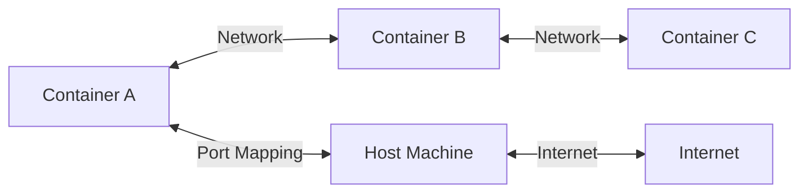
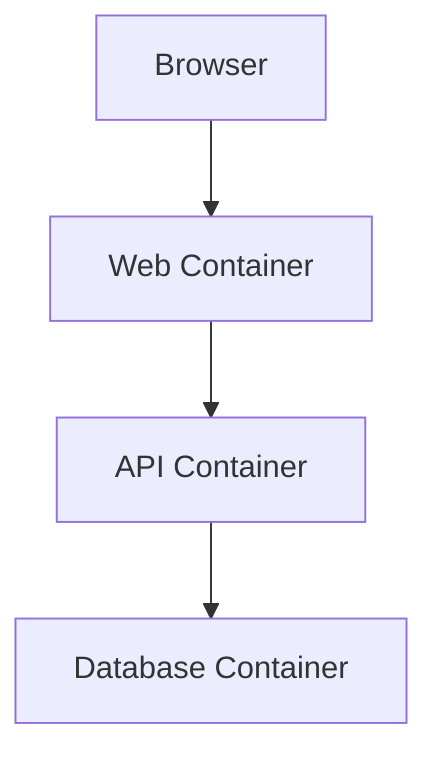
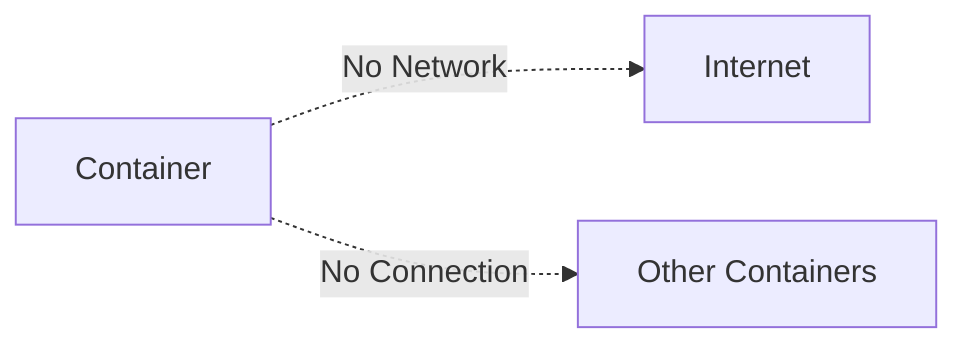
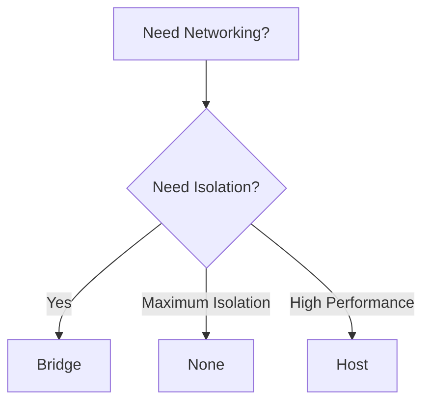
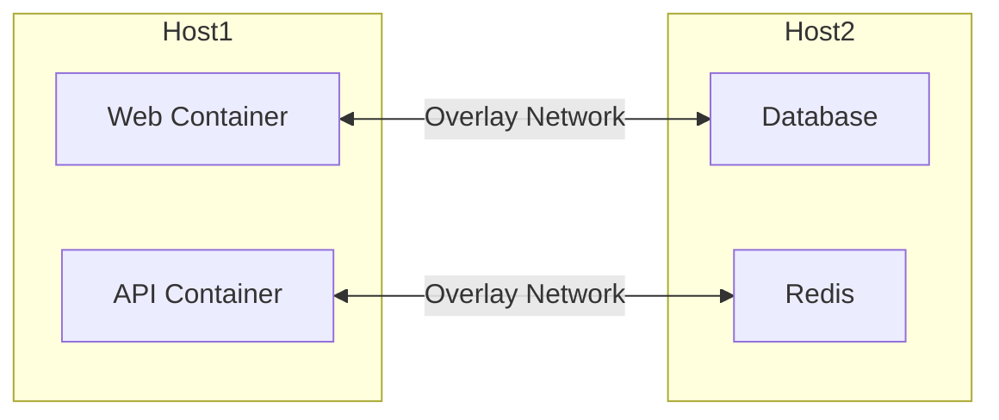
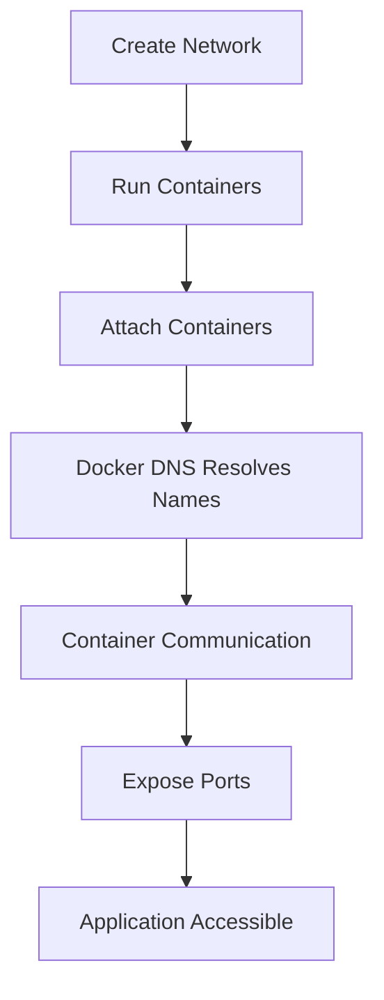

# 🐳 06. Docker Networking — Complete Guide

---

# 📖 What is Docker Networking?

Docker Networking is the mechanism that allows **containers to communicate** with:

- 📦 Other containers
- 🖥️ Host machine
- 🌍 External networks (Internet)
- ☁️ Containers running on other hosts

Without networking, containers would be isolated and unable to exchange data.

---

## 🎯 Why is Docker Networking Important?

Docker Networking helps to:

- 🌐 Connect multiple containers
- 📡 Access applications from browsers
- 🔄 Enable communication between services
- 📂 Build microservices architecture
- ☁️ Support distributed applications

Example:

- Web Server (Nginx)
- Backend API
- Database (MySQL)

All three containers communicate through Docker networking.

---

## 📊 Docker Networking Overview



---

# ❓ Why Networking?

Containers are isolated by default.

Imagine a web application:

```text
Browser
   │
   ▼
Web Server
   │
   ▼
Backend API
   │
   ▼
Database
```

If networking didn't exist:

- Browser cannot access Web Server ❌
- Web Server cannot access API ❌
- API cannot access Database ❌

Networking solves these communication problems.

---

## 📊 Communication Flow



---

# 🌉 Bridge Network

---

# 📖 What is a Bridge Network?

Bridge is Docker's **default network driver**.

Whenever a container is created, Docker automatically connects it to the **bridge network** unless another network is specified.

Containers on the same bridge network can communicate with each other.

---

## 🧾 View Available Networks

```bash
docker network ls
```

---

## 🧪 Output Example

```text
NETWORK ID     NAME      DRIVER
abc123         bridge    bridge
xyz456         host      host
def789         none      null
```

---

## 🧾 Inspect Bridge Network

```bash
docker network inspect bridge
```

---

## ❓ What it shows

- Connected containers
- Network subnet
- Gateway
- Driver
- Network configuration

---

## 🧾 Run a Container on Bridge Network

```bash
docker run -dit \
--name web \
nginx
```

Docker automatically connects it to the bridge network.

---

## 📊 Bridge Network Architecture


---

## ✅ Advantages

- Default Docker network
- Easy to use
- Supports container communication
- Automatically created

---

## ⚠️ Limitations

- Communication is limited to the same Docker host.
- Not suitable for multi-host environments.

---

# 🏠 Host Network

---

# 📖 What is Host Network?

Host Network removes the network isolation between the container and the host machine.

Instead of creating its own network namespace, the container directly uses the host's networking stack.

---

## 🧾 Syntax

```bash
docker run --network host image
```

---

## 🧾 Example

```bash
docker run --network host nginx
```

---

## ❓ What happens?

Normally:

```text
Container → Docker Network → Host
```

With Host Network:

```text
Container → Host Network Directly
```

No virtual bridge is created.

---

## 📊 Host Network Flow


---

## ✅ Advantages

- Better network performance
- Lower latency
- No port mapping required

---

## ⚠️ Disadvantages

- No network isolation
- Port conflicts may occur
- Less secure than bridge mode

---

## 🎯 Best Use Cases

- High-performance networking
- Monitoring tools
- Network-intensive applications

---

# 🚫 None Network

---

# 📖 What is None Network?

The **None Network** completely disables networking for a container.

The container:

- Cannot access Internet
- Cannot communicate with other containers
- Has no external network interface

Only the loopback interface (`lo`) is available.

---

## 🧾 Syntax

```bash
docker run --network none image
```

---

## 🧾 Example

```bash
docker run -it \
--network none \
ubuntu bash
```

---

## 🧾 Check Network Interfaces

Inside the container:

```bash
ip addr
```

---

## 🧪 Output Example

```text
1: lo:
```

Only the loopback interface exists.

---

## 📊 None Network Architecture



---

## ✅ Advantages

- Complete isolation
- Improved security
- Useful for offline processing

---

## ⚠️ Limitations

- No Internet access
- No container communication
- External services cannot reach the container

---

# 📊 Comparison of Network Types

| Feature | Bridge | Host | None |
|----------|--------|------|------|
| Internet Access | ✅ | ✅ | ❌ |
| Container Communication | ✅ | ✅ | ❌ |
| Isolation | ✅ | ❌ | ✅ |
| Requires Port Mapping | ✅ | ❌ | ❌ |
| Multi-Container Support | ✅ | Limited | ❌ |

---

# 🎯 Choosing a Network



---

# 📌 Key Takeaways

- 🌉 Bridge is Docker's default network.
- 🏠 Host network shares the host's networking stack.
- 🚫 None network completely isolates the container.
- 🌐 Networking enables communication between containers and external systems.
- 🎯 Choose the network type based on performance, security, and communication needs.

---

# 📚 Summary

Docker Networking allows containers to communicate with each other, the host machine, and external networks.

In this chapter, you learned:

- ❓ Why Docker Networking is important
- 🌉 Bridge Network
- 🏠 Host Network
- 🚫 None Network

These networking modes form the foundation for connecting Docker containers in different environments.

---
# ☁️ Overlay Network (Introduction)

---

# 📖 What is an Overlay Network?

An **Overlay Network** is a Docker network driver that enables containers running on **multiple Docker hosts** to communicate as if they were on the same network.

Unlike the **Bridge Network**, which works only on a single Docker host, an Overlay Network spans across multiple hosts.

It is mainly used with:

- ☁️ Docker Swarm
- ☸️ Container orchestration platforms
- 🌍 Distributed applications
- 🏢 Multi-host deployments

---

## ❓ Why Use an Overlay Network?

Imagine an application deployed on two servers.

```text
Server 1
 ├── Web Container
 └── API Container

Server 2
 ├── Database Container
 └── Cache Container
```

Without an Overlay Network, these containers cannot communicate directly.

An Overlay Network creates a **virtual network** connecting all containers across different hosts.

---

## 📊 Overlay Network Architecture



---

## 🧾 Create an Overlay Network

> **Note:** Overlay networks require Docker Swarm to be initialized.

```bash
docker network create \
-d overlay \
my-overlay
```

---

## ✅ Advantages

- Supports multiple Docker hosts
- Secure communication
- Automatic service discovery
- Ideal for microservices

---

## ⚠️ Limitations

- Requires Docker Swarm
- Slightly more complex than Bridge Network
- Small networking overhead

---

# 🔌 Port Mapping

---

# 📖 What is Port Mapping?

Containers have their own internal ports.

Port Mapping allows applications running inside a container to be accessed from the host machine.

Without port mapping, applications inside the container are **not accessible** from outside.

---

## 🧾 Syntax

```bash
docker run -p <host-port>:<container-port> image
```

---

## 🧾 Example

```bash
docker run -d \
-p 8080:80 \
nginx
```

---

## ❓ What it does

- Host Port → **8080**
- Container Port → **80**

Open your browser:

```text
http://localhost:8080
```

The request is forwarded to port **80** inside the container.

---

## 📊 Port Mapping Flow


---

## 🧾 View Port Mapping

```bash
docker ps
```

---

## 🧪 Output Example

```text
PORTS

0.0.0.0:8080->80/tcp
```

---

## ✅ Advantages

- Exposes applications externally
- Simple configuration
- Supports web applications, APIs, and databases

---

# 🌐 DNS Resolution

---

# 📖 What is DNS Resolution?

Docker provides an **internal DNS server**.

Instead of using IP addresses, containers can communicate using **container names**.

This makes applications easier to configure and maintain.

---

## ❓ Without DNS

Container A wants to connect to MySQL.

```text
172.18.0.5
```

If the container restarts:

```text
172.18.0.8
```

The IP address changes.

---

## ❓ With Docker DNS

Container simply uses:

```text
mysql
```

Docker automatically resolves the container name to its current IP address.

---

## 🧾 Example

Create a custom network.

```bash
docker network create mynetwork
```

Run MySQL:

```bash
docker run -d \
--name mysql \
--network mynetwork \
mysql
```

Run another container:

```bash
docker run -it \
--network mynetwork \
ubuntu bash
```

Inside the container:

```bash
ping mysql
```

Docker resolves **mysql** automatically.

---

## 📊 DNS Resolution Flow


---

## ✅ Benefits

- No need to remember IP addresses
- Automatic service discovery
- Easier application configuration
- Works inside custom Docker networks

---

# 🛠️ Custom Networks

---

# 📖 What is a Custom Network?

A Custom Network is a user-created Docker network.

Unlike the default Bridge Network, it provides:

- Better container isolation
- Automatic DNS resolution
- Easier service communication

---

# 🆕 Create a Custom Network

## 🧾 Syntax

```bash
docker network create <network-name>
```

---

## 🧾 Example

```bash
docker network create app-network
```

---

## 🧪 Output

```text
app-network
```

---

# 📋 List Networks

## 🧾 Syntax

```bash
docker network ls
```

---

## 🧪 Output Example

```text
NETWORK ID

bridge

host

none

app-network
```

---

# 🔍 Inspect Network

## 🧾 Syntax

```bash
docker network inspect app-network
```

---

## ❓ What it shows

- Connected containers
- Gateway
- Subnet
- Driver
- Configuration

---

# 🔗 Connect a Container

## 🧾 Example

```bash
docker run -dit \
--name web \
--network app-network \
nginx
```

---

Another container:

```bash
docker run -it \
--name client \
--network app-network \
ubuntu bash
```

Inside client container:

```bash
ping web
```

Docker resolves the name **web** automatically.

---

# 📊 Custom Network Flow


---

# ⚠️ Common Issues

---

## ❌ Cannot Access Application

### Possible Reasons

- Port not mapped
- Wrong port number
- Container not running

### ✔ Fix

Check running containers.

```bash
docker ps
```

Verify port mapping.

---

## ❌ Containers Cannot Communicate

### ✔ Fix

Check network.

```bash
docker network ls
```

Inspect the network.

```bash
docker network inspect app-network
```

Ensure both containers are attached to the same network.

---

## ❌ Unknown Host

```text
ping: unknown host mysql
```

### ✔ Fix

- Verify container name.
- Use a custom network.
- Check if the target container is running.

---

## ❌ Port Already in Use

```text
Bind for 0.0.0.0:8080 failed
```

### ✔ Fix

Choose another host port.

```bash
docker run -p 8081:80 nginx
```

---

# 📊 Complete Docker Networking Workflow



---

# 📌 Key Takeaways

- 🌉 Bridge Network is the default network for Docker containers.
- 🏠 Host Network shares the host's networking stack.
- 🚫 None Network completely isolates a container.
- ☁️ Overlay Network connects containers across multiple Docker hosts.
- 🔌 Port Mapping exposes container applications to the host.
- 🌐 Docker DNS allows containers to communicate using names instead of IP addresses.
- 🛠️ Custom Networks provide better isolation and automatic service discovery.

---

# 📚 Summary

Docker Networking enables seamless communication between containers, the host machine, and external networks.

In this chapter, you learned about:

- 🌉 Bridge Network
- 🏠 Host Network
- 🚫 None Network
- ☁️ Overlay Network
- 🔌 Port Mapping
- 🌐 DNS Resolution
- 🛠️ Custom Networks

Understanding these networking options helps you design secure, scalable, and well-connected containerized applications in both development and production environments.

---