# 🐳 07. Dockerfile — Complete Guide

---

# 📖 What is a Dockerfile?

A **Dockerfile** is a text file that contains a set of instructions used to automatically build a Docker Image.

Instead of manually creating containers and installing software every time, you can write all the required steps in a Dockerfile.

Docker reads the Dockerfile line by line and creates an image.

---

## 🎯 Why Use a Dockerfile?

Without a Dockerfile:

- Install operating system packages manually
- Install application dependencies manually
- Copy source code manually
- Configure environment manually
- Repeat the same steps every time

With a Dockerfile:

- ✅ Automatic image creation
- ✅ Repeatable builds
- ✅ Easy sharing
- ✅ Version control support
- ✅ Faster deployment

---

## 📊 Dockerfile Workflow

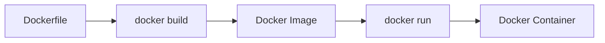

---

# ❓ Why Build Custom Images?

Docker Hub provides thousands of ready-made images like:

- Ubuntu
- Nginx
- MySQL
- Redis
- Python
- Node.js

However, real-world applications require additional customization.

Example:

A Python application may need:

- Python
- Flask
- Project source code
- Environment variables
- Required packages
- Startup command

Instead of configuring these manually every time, we create a custom Docker image.

---

## 📊 Example

Without Custom Image

```text
Ubuntu Image

↓

Install Python

↓

Install Flask

↓

Copy Application

↓

Run Application
```

Every container requires repeating these steps.

---

With Custom Image

```text
Dockerfile

↓

Docker Image

↓

Container Ready
```

Everything is pre-configured.

---

## ✅ Benefits of Custom Images

- Faster deployment
- Reusable
- Consistent environments
- Easy CI/CD integration
- Easy team collaboration

---

# 📄 Dockerfile Structure

A Dockerfile consists of multiple instructions.

Example:

```dockerfile
FROM ubuntu

WORKDIR /app

COPY . .

RUN apt update

CMD ["bash"]
```

Docker executes every instruction from top to bottom.

---

## 📊 Build Process

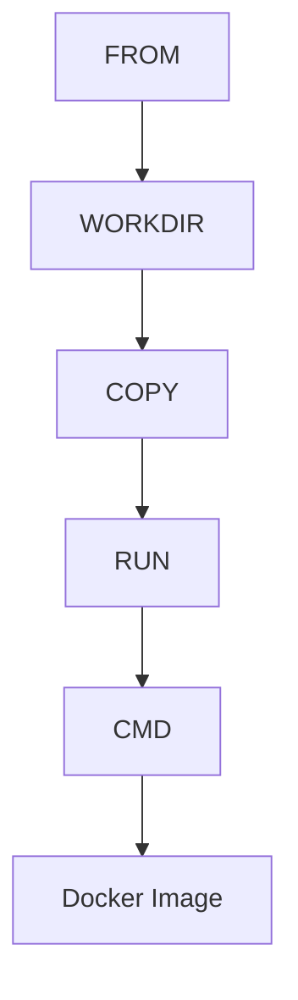

---

# 📦 FROM Instruction

---

# 📖 What is FROM?

`FROM` specifies the **base image** used to build the new image.

Every Dockerfile starts with a `FROM` instruction.

---

## 🧾 Syntax

```dockerfile
FROM image-name
```

---

## 🧾 Example

```dockerfile
FROM ubuntu
```

---

Another example

```dockerfile
FROM python:3.12
```

---

## ❓ What it does

Docker downloads the specified image (if not already available) and uses it as the foundation for the new image.

---

## 📊 Example

```text
Ubuntu Image

↓

Your Custom Image

↓

Container
```

---

## ✅ Best Practice

Always use a specific version.

Good

```dockerfile
FROM python:3.12
```

Better than

```dockerfile
FROM python:latest
```

---

# 📂 WORKDIR Instruction

---

# 📖 What is WORKDIR?

`WORKDIR` sets the working directory for all subsequent instructions.

If the directory does not exist, Docker creates it automatically.

---

## 🧾 Syntax

```dockerfile
WORKDIR /directory
```

---

## 🧾 Example

```dockerfile
WORKDIR /app
```

---

## ❓ What it does

After this instruction,

all future commands execute inside:

```text
/app
```

---

Example

```dockerfile
WORKDIR /app

COPY . .

RUN ls
```

The `COPY` and `RUN` instructions work inside `/app`.

---

## 📊 WORKDIR Flow

```mermaid
flowchart LR

A[Container]

--> B[/app]

--> C[All Future Commands]
```

---

## ✅ Advantages

- Cleaner Dockerfiles
- Avoids repeated paths
- Automatically creates directory

---

# 📄 COPY Instruction

---

# 📖 What is COPY?

`COPY` copies files or folders from the host machine into the Docker image.

---

## 🧾 Syntax

```dockerfile
COPY <source> <destination>
```

---

## 🧾 Example

```dockerfile
COPY . .
```

---

Another example

```dockerfile
COPY app.py /app
```

---

## ❓ What it does

Copies

```text
Host Machine
```

↓

to

```text
Docker Image
```

---

## Example

Project

```text
project/

│── app.py

│── requirements.txt
```

Dockerfile

```dockerfile
COPY . .
```

Everything inside the project directory is copied into the image.

---

## 📊 COPY Flow

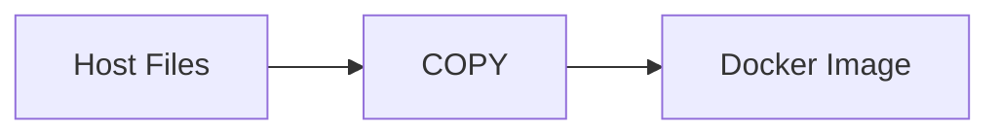

---

## ✅ When to Use COPY?

Use COPY for:

- Source code
- Configuration files
- Static assets
- Project files

---

# 📥 ADD Instruction

---

# 📖 What is ADD?

`ADD` is similar to `COPY`, but it has additional capabilities.

It can:

- Copy files
- Copy directories
- Automatically extract local archive files
- Download files from URLs (not generally recommended)

---

## 🧾 Syntax

```dockerfile
ADD <source> <destination>
```

---

## 🧾 Example

```dockerfile
ADD project.tar.gz /app
```

Docker automatically extracts the archive.

---

Another example

```dockerfile
ADD https://example.com/file.txt /app
```

---

## ❓ COPY vs ADD

| Feature | COPY | ADD |
|----------|------|-----|
| Copy Files | ✅ | ✅ |
| Copy Directories | ✅ | ✅ |
| Extract Archives | ❌ | ✅ |
| Download URL | ❌ | ✅ |

---

## ⚠️ Best Practice

Prefer using **COPY** whenever possible.

Use **ADD** only when you need:

- Archive extraction
- URL download

---

## 📊 ADD Flow

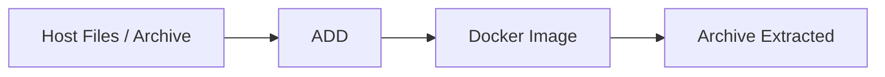

---

# 📌 Key Takeaways

- 🐳 Dockerfile automates Docker image creation.
- 📦 `FROM` defines the base image.
- 📂 `WORKDIR` sets the working directory.
- 📄 `COPY` copies files from the host into the image.
- 📥 `ADD` extends `COPY` with archive extraction and URL support.
- 🏗️ Docker processes Dockerfile instructions from top to bottom.

---

# 📚 Summary

A Dockerfile is a blueprint used to build Docker images in a consistent and automated way.

In this part, you learned:

- 📖 What is a Dockerfile?
- ❓ Why build custom images?
- 📄 Dockerfile structure
- 📦 `FROM`
- 📂 `WORKDIR`
- 📄 `COPY`
- 📥 `ADD`

These instructions form the foundation of every Dockerfile. In the next part, you'll learn how to install software, configure the runtime environment, and define how containers start using `RUN`, `CMD`, `ENTRYPOINT`, `ENV`, `ARG`, and `EXPOSE`.

---
# 🐳 07. Dockerfile — Part 2 (Build & Runtime Instructions)

---

# 📦 RUN Instruction

---

# 📖 What is RUN?

The `RUN` instruction executes commands **during image build time**.

It is used to install packages, update system libraries, and prepare the environment.

---

## 🧾 Syntax

```dockerfile
RUN <command>
```

---

## 🧾 Example

```dockerfile
RUN apt update
```

---

Another example

```dockerfile
RUN apt install -y curl
```

---

## ❓ What it does

- Executes inside the image layer
- Creates a new image layer after execution
- Used for setup tasks

---

## 📊 RUN Flow

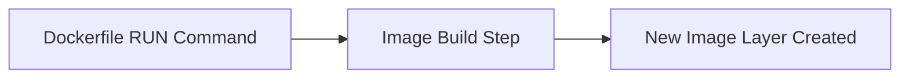

---

## ⚠️ Important Note

Each `RUN` creates a new layer, so combine commands when possible.

Better:

```dockerfile
RUN apt update && apt install -y curl
```

---

# ▶️ CMD Instruction

---

# 📖 What is CMD?

`CMD` defines the **default command** that runs when a container starts.

It executes at **runtime (not build time)**.

---

## 🧾 Syntax

```dockerfile
CMD ["executable", "param1", "param2"]
```

---

## 🧾 Example

```dockerfile
CMD ["bash"]
```

---

Another example

```dockerfile
CMD ["python", "app.py"]
```

---

## ❓ What it does

- Runs when container starts
- Only one CMD is used (last one wins)
- Can be overridden at runtime

---

## 🧪 Example Override

```bash
docker run image-name ls
```

This overrides CMD.

---

## 📊 CMD Flow

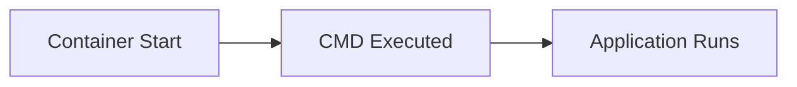

---

# 🚀 ENTRYPOINT Instruction

---

# 📖 What is ENTRYPOINT?

`ENTRYPOINT` defines the **main executable container behavior**.

Unlike CMD, it is harder to override.

---

## 🧾 Syntax

```dockerfile
ENTRYPOINT ["executable"]
```

---

## 🧾 Example

```dockerfile
ENTRYPOINT ["python"]
```

---

Run container:

```bash
docker run image app.py
```

This becomes:

```bash
python app.py
```

---

## 📊 CMD vs ENTRYPOINT

| Feature | CMD | ENTRYPOINT |
|----------|-----|------------|
| Default command | ✅ | ❌ |
| Always executed | ❌ | ✅ |
| Easy override | ✅ | ❌ (hard) |
| Best use | Default behavior | Fixed behavior |

---

## 🎯 Best Practice

Use both together:

```dockerfile
ENTRYPOINT ["python"]
CMD ["app.py"]
```

---

## 📊 Combined Flow

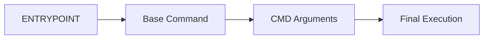

---

# 🌐 ENV Instruction

---

# 📖 What is ENV?

`ENV` is used to set **environment variables inside the container**.

---

## 🧾 Syntax

```dockerfile
ENV KEY=value
```

---

## 🧾 Example

```dockerfile
ENV APP_ENV=production
```

---

Another example

```dockerfile
ENV PORT=8080
```

---

## ❓ What it does

- Sets environment variables
- Available during build and runtime
- Used for configuration

---

## 🧪 Example Usage

```dockerfile
ENV NAME=DockerApp

CMD echo $NAME
```

---

## 📊 ENV Flow

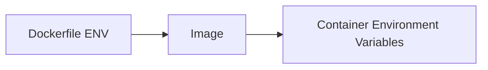

---

# 🏷️ ARG Instruction

---

# 📖 What is ARG?

`ARG` defines variables used **only during build time**.

Unlike ENV, ARG is not available in running containers.

---

## 🧾 Syntax

```dockerfile
ARG VARIABLE_NAME
```

---

## 🧾 Example

```dockerfile
ARG VERSION=1.0
```

---

## 🧾 Usage in Dockerfile

```dockerfile
FROM ubuntu:${VERSION}
```

---

## 🧪 Build Example

```bash
docker build --build-arg VERSION=22.04 .
```

---

## 📊 ARG Flow

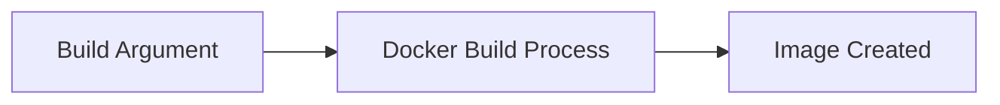

---

## ⚠️ Difference: ARG vs ENV

| Feature | ARG | ENV |
|----------|-----|-----|
| Build time | ✅ | ❌ |
| Runtime | ❌ | ✅ |
| Accessible in container | ❌ | ✅ |

---

# 🔌 EXPOSE Instruction

---

# 📖 What is EXPOSE?

`EXPOSE` documents which port the container listens on.

It does NOT publish the port automatically.

---

## 🧾 Syntax

```dockerfile
EXPOSE <port>
```

---

## 🧾 Example

```dockerfile
EXPOSE 80
```

---

## ❓ What it does

- Indicates container listening port
- Used as documentation
- Helps with port mapping

---

## 📊 EXPOSE Flow

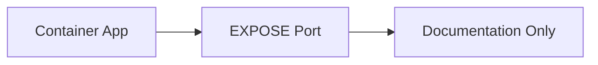

---

## ⚠️ Important Note

You still need `-p` to access the container externally.

```bash
docker run -p 8080:80 image
```

---

# 📌 Key Takeaways

- 🏗️ `RUN` executes commands during image build
- ▶️ `CMD` defines default container startup command
- 🚀 `ENTRYPOINT` defines fixed container behavior
- 🌐 `ENV` sets runtime environment variables
- 🏷️ `ARG` is used only during build time
- 🔌 `EXPOSE` documents container ports (not publishing them)

---

# 📚 Summary

In this part, you learned the core execution and configuration instructions of Dockerfile:

- RUN → builds image layers
- CMD → default runtime command
- ENTRYPOINT → fixed execution behavior
- ENV → runtime configuration
- ARG → build-time variables
- EXPOSE → port documentation

These instructions control how your container is built and how it behaves when executed.

---

👉 Next: **Part 3 (Advanced Dockerfile + Best Practices + Full Example)**
# 🐳 07. Dockerfile — Part 3 (Advanced Instructions + Best Practices)

---

# 🏷️ LABEL Instruction

---

# 📖 What is LABEL?

`LABEL` is used to add **metadata** to a Docker image.

It helps describe the image (author, version, description, etc.).

---

## 🧾 Syntax

```dockerfile
LABEL key="value"
```

---

## 🧾 Example

```dockerfile
LABEL maintainer="dev@example.com"
```

---

Multiple labels:

```dockerfile
LABEL version="1.0" \
      description="My Docker App" \
      author="Dev Team"
```

---

## ❓ What it does

- Adds metadata to image
- Helps in documentation
- Useful in CI/CD pipelines

---

## 📊 LABEL Flow

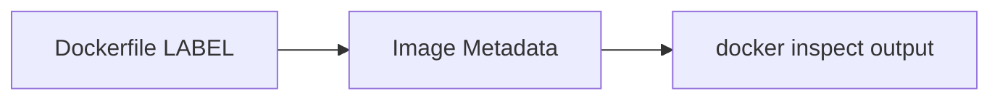

---

# 👤 USER Instruction

---

# 📖 What is USER?

`USER` defines the user under which the container runs.

By default, containers run as **root**.

---

## 🧾 Syntax

```dockerfile
USER <username>
```

---

## 🧾 Example

```dockerfile
RUN useradd appuser
USER appuser
```

---

## ❓ What it does

- Changes execution user
- Improves security
- Prevents root-level access

---

## 📊 USER Flow

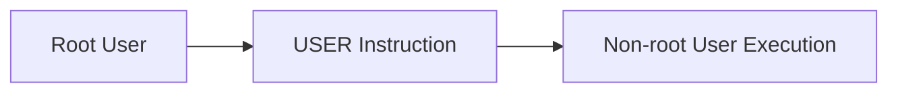

---

## 🔐 Best Practice

Always use a non-root user in production images.

---

# 📦 VOLUME Instruction

---

# 📖 What is VOLUME?

`VOLUME` is used to create a **mount point for persistent storage** inside a container.

---

## 🧾 Syntax

```dockerfile
VOLUME ["/path"]
```

---

## 🧾 Example

```dockerfile
VOLUME ["/data"]
```

---

## ❓ What it does

- Creates mount point
- Enables data persistence
- Data stored outside container lifecycle

---

## 📊 VOLUME Flow

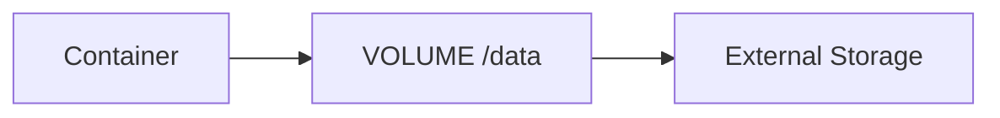

---

## ⚠️ Note

Actual storage location is managed by Docker.

---

# ❤️ HEALTHCHECK Instruction

---

# 📖 What is HEALTHCHECK?

`HEALTHCHECK` tells Docker how to test if a container is **running properly**.

---

## 🧾 Syntax

```dockerfile
HEALTHCHECK CMD <command>
```

---

## 🧾 Example

```dockerfile
HEALTHCHECK CMD curl -f http://localhost:80 || exit 1
```

---

## ❓ What it does

- Periodically checks container health
- Marks container as healthy/unhealthy
- Helps in production monitoring

---

## 🧪 Docker Status Example

```text
Up (healthy)
Up (unhealthy)
```

---

## 📊 HEALTHCHECK Flow

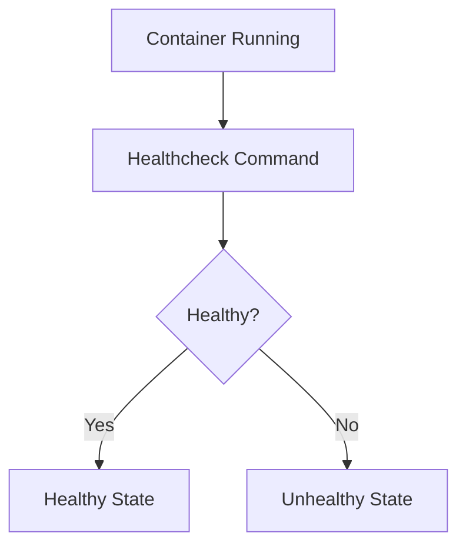

---

# 🧪 Complete Dockerfile Example

```dockerfile
FROM python:3.12

LABEL maintainer="dev@example.com"

WORKDIR /app

COPY . .

RUN pip install flask

ENV APP_ENV=production

EXPOSE 5000

USER root

CMD ["python", "app.py"]

HEALTHCHECK CMD curl -f http://localhost:5000 || exit 1
```

---

# 🏗️ Build Docker Image

## 🧾 Syntax

```bash
docker build -t myapp .
```

---

## 🧾 Example

```bash
docker build -t flask-app .
```

---

## ❓ What it does

- Reads Dockerfile
- Executes instructions step-by-step
- Creates Docker image

---

## 📊 Build Flow

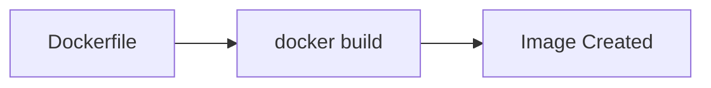

---

# ▶️ Run Docker Container

## 🧾 Syntax

```bash
docker run -p host:container image
```

---

## 🧾 Example

```bash
docker run -p 5000:5000 flask-app
```

---

# ⚠️ Common Mistakes

---

## ❌ Wrong COPY path

```dockerfile
COPY app /app
```

✔ Fix:

```dockerfile
COPY . /app
```

---

## ❌ Missing CMD

Container exits immediately.

✔ Fix:

```dockerfile
CMD ["bash"]
```

---

## ❌ Using too many RUN layers

✔ Fix:

```dockerfile
RUN apt update && apt install -y curl git
```

---

## ❌ Running as root in production

✔ Fix:

```dockerfile
USER appuser
```

---

# 🎯 Best Practices

---

## 🚀 1. Use minimal base images

```dockerfile
FROM python:3.12-slim
```

---

## 🚀 2. Combine RUN commands

Reduces image size.

---

## 🚀 3. Use .dockerignore

Exclude unnecessary files.

---

## 🚀 4. Use non-root users

Improves security.

---

## 🚀 5. Use specific versions

Avoid:

```dockerfile
FROM python:latest
```

Prefer:

```dockerfile
FROM python:3.12
```

---

## 🚀 6. Order instructions properly

```text
FROM → WORKDIR → COPY → RUN → CMD
```

---

# 📊 Dockerfile Build Lifecycle

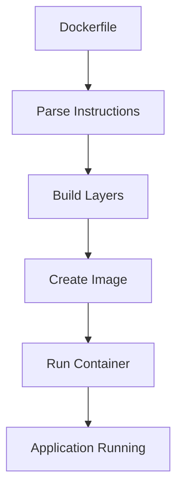

---

# 📌 Key Takeaways

- 🏷️ LABEL adds metadata to images
- 👤 USER improves container security
- 📦 VOLUME defines persistent storage paths
- ❤️ HEALTHCHECK monitors container health
- 🏗️ Dockerfile builds images layer by layer
- ▶️ Containers are created from images using `docker run`

---

# 📚 Final Summary

Dockerfile is the foundation of Docker image creation.

In this full chapter, you learned:

- 📖 Why Dockerfiles are needed
- 📦 Core instructions (FROM, COPY, WORKDIR, ADD)
- ▶️ Runtime instructions (CMD, ENTRYPOINT)
- 🌐 Configuration instructions (ENV, ARG, EXPOSE)
- 🏷️ Advanced instructions (LABEL, USER, VOLUME, HEALTHCHECK)
- 🏗️ Image build process
- ▶️ Container execution flow
- ⚠️ Common mistakes
- 🚀 Best practices

---

# 🎯 You Now Understand Dockerfile Completely

You can now:

- Build custom Docker images
- Configure runtime behavior
- Secure containers
- Optimize image size
- Deploy production-ready applications

---