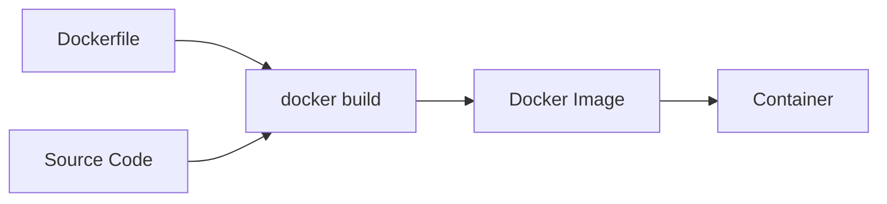
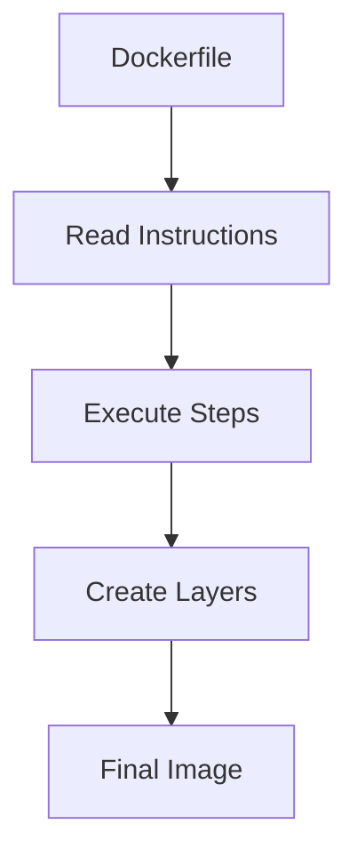
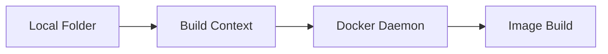
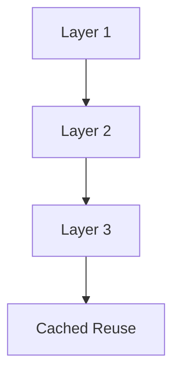
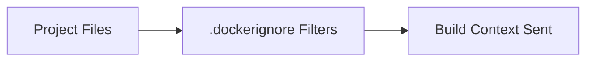
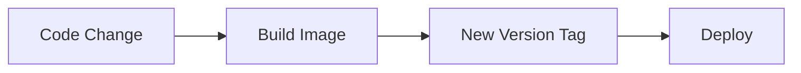
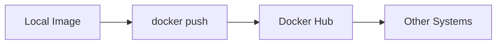
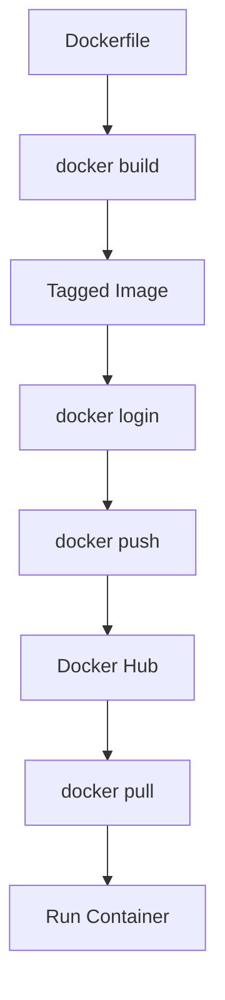

# 🐳 08. Building Images — Complete Guide

---

# 📖 What is Docker Image Building?

Docker Image Building is the process of converting a **Dockerfile + application code** into a **Docker Image**.

This image can then be used to run containers anywhere.

---

## 🎯 Why Build Images?

Without building images:

- You cannot package applications 📦
- You cannot share environments 🌍
- You cannot deploy containers 🚀

With image building:

- ✅ Portable applications
- ✅ Reproducible environments
- ✅ Easy deployment
- ✅ CI/CD ready

---

## 📊 Docker Image Build Flow



---

# 🏗️ docker build

---

# 📖 What is docker build?

`docker build` is the command used to create a Docker image from a Dockerfile.

---

## 🧾 Syntax

```bash
docker build -t <image-name> .
```

---

## 🧾 Example

```bash
docker build -t myapp .
```

---

## ❓ What it does

- Reads Dockerfile
- Executes instructions step-by-step
- Creates image layers
- Produces final Docker image

---

## 📊 Build Process



---

# 📦 Build Context

---

# 📖 What is Build Context?

Build context is the **set of files available to Docker during build time**.

It is sent to the Docker daemon when running `docker build`.

---

## 🧾 Example

```bash
docker build -t myapp .
```

Here:

```text
.  → current directory = build context
```

---

## ❓ What it includes

- Dockerfile
- Application code
- Config files
- Dependencies

---

## ⚠️ Important Note

Docker can only access files inside the build context.

---

## 📊 Build Context Flow



---

## 🚨 Best Practice

Keep build context small:

- Remove unnecessary files
- Use `.dockerignore`

---

# ⚡ Layer Cache

---

# 📖 What is Layer Cache?

Docker builds images in **layers**.

Each instruction in Dockerfile creates a layer.

Docker reuses unchanged layers using **cache**, making builds faster.

---

## 🧾 Example

```dockerfile
FROM ubuntu
RUN apt update
RUN apt install -y curl
COPY . .
```

---

## ❓ How caching works

If nothing changes in a layer:

- Docker reuses previous build result
- Skips execution
- Speeds up build

---

## 📊 Cache Flow



---

## ⚠️ Cache Invalidation

Cache breaks when:

- File changes
- Order changes
- Base image changes

---

## 🚀 Optimization Tip

Place stable instructions first:

```dockerfile
RUN apt update
COPY requirements.txt .
RUN pip install -r requirements.txt
COPY . .
```

---

# 🚫 .dockerignore

---

# 📖 What is .dockerignore?

`.dockerignore` is a file used to exclude unnecessary files from the build context.

It works like `.gitignore`.

---

## 🧾 Example

```text
node_modules
.git
*.log
__pycache__
.env
```

---

## ❓ Why use it?

- Reduces build size
- Speeds up builds
- Improves security
- Prevents sensitive data leakage

---

## 📊 Flow



---

## 🚀 Best Practice

Always include `.dockerignore` in projects.

---

# 🏷️ Image Tagging

---

# 📖 What is Image Tagging?

Tagging is used to give a **name and version** to Docker images.

---

## 🧾 Syntax

```bash
docker build -t name:tag .
```

---

## 🧾 Example

```bash
docker build -t myapp:1.0 .
```

---

## ❓ What it does

- Identifies image version
- Helps manage multiple builds
- Supports rollback

---

## 📊 Tag Example

```text
myapp:1.0
myapp:2.0
myapp:latest
```

---

## 🚨 Best Practice

Avoid only using `latest`.

Use version tags:

```bash
myapp:1.0
myapp:1.1
myapp:2.0
```

---

# 🔁 Versioning

---

# 📖 What is Versioning?

Versioning is the practice of assigning **incremental versions** to Docker images.

---

## 🧾 Example Strategy

```text
myapp:1.0
myapp:1.1
myapp:2.0
```

---

## ❓ Why versioning is important

- Easy rollback
- Production stability
- Change tracking
- CI/CD compatibility

---

## 📊 Versioning Flow



---

# 📤 Login to Docker Hub

---

# 📖 What is docker login?

`docker login` is used to authenticate with Docker Hub.

---

## 🧾 Syntax

```bash
docker login
```

---

## 🧾 Example

```bash
docker login
```

Then enter:

- Username
- Password

---

## ❓ What it does

- Authenticates user
- Enables image push/pull
- Connects local system to Docker Hub

---

# 📤 Push Image

---

# 📖 What is docker push?

`docker push` uploads a Docker image to Docker Hub.

---

## 🧾 Syntax

```bash
docker push <username>/<image>:tag
```

---

## 🧾 Example

```bash
docker push devuser/myapp:1.0
```

---

## ❓ What it does

- Uploads image layers
- Makes image public/private
- Enables sharing with others

---

## 📊 Push Flow



---

# 📥 Pull Image (Reference)

---

## 🧾 Syntax

```bash
docker pull image:tag
```

---

## 🧾 Example

```bash
docker pull nginx:latest
```

---

# 📊 Complete Image Lifecycle



---

# ⚠️ Common Issues

---

## ❌ Build fails (missing files)

✔ Fix:

Check build context.

---

## ❌ Cache not updating

✔ Fix:

```bash
docker build --no-cache -t myapp .
```

---

## ❌ Push denied

✔ Fix:

```bash
docker login
```

and ensure correct image name:

```bash
username/image:tag
```

---

# 📌 Key Takeaways

- 🏗️ `docker build` creates images from Dockerfile
- 📦 Build context contains all required files
- ⚡ Layer caching speeds up builds
- 🚫 `.dockerignore` reduces unnecessary files
- 🏷️ Tags define image versions
- 🔁 Versioning ensures stable deployments
- 📤 `docker push` uploads images to registry
- 📥 `docker pull` downloads images

---

# 📚 Summary

Building Docker images is the foundation of containerization.

In this chapter, you learned:

- How Docker builds images
- Importance of build context
- Layer caching mechanism
- Using `.dockerignore`
- Image tagging and versioning
- Docker Hub login and push workflow

This completes the full workflow from **code → image → registry → deployment**.

---