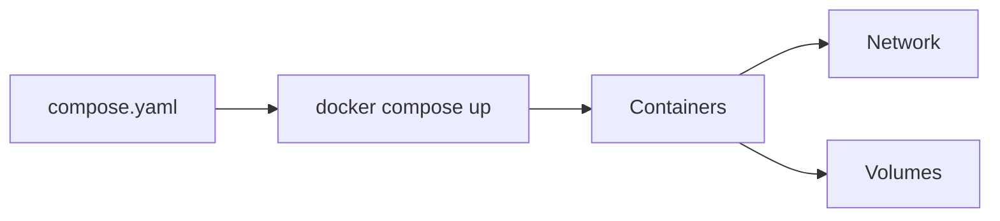
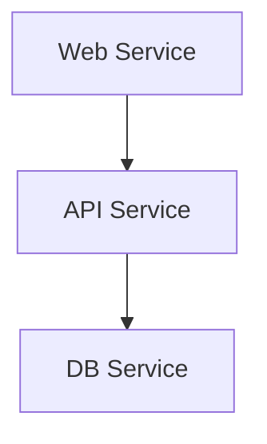
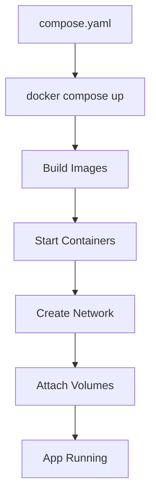

# 🐳 09. Docker Compose — Complete (Production Guide)

---

# 📖 What is Docker Compose?

Docker Compose is a tool used to define and run **multi-container applications** using a single YAML file.

Instead of running multiple `docker run` commands, you define everything in:

```text
compose.yaml
```

Then start everything using:

```bash
docker compose up
```

---

## 🎯 Why Docker Compose?

Without Compose:

- ❌ Multiple container commands
- ❌ Manual networking
- ❌ Hard to scale services
- ❌ Difficult environment setup

With Compose:

- ✅ Single configuration file
- ✅ Easy multi-service setup
- ✅ Built-in networking
- ✅ Reusable environments
- ✅ Production-ready structure

---

## 📊 Docker Compose Architecture



---

# 📄 compose.yaml (Full Structure Overview)

A complete Compose file can include:

```yaml
services:
networks:
volumes:
configs:
secrets:
```

We will cover all major production-level features below.

---

# 🧩 SERVICES (Core of Compose)

---

# 📖 What are Services?

A service defines a **container configuration**.

Each service = one running container.

---

## 🧾 Basic Example

```yaml
services:
  web:
    image: nginx
```

---

# 🏗️ Build (Custom Images)

```yaml
services:
  app:
    build:
      context: .
      dockerfile: Dockerfile
```

---

# 📦 Image

```yaml
image: nginx:latest
```

---

# 🔌 Ports

```yaml
ports:
  - "8080:80"
```

---

# 🌐 Environment Variables

```yaml
environment:
  NODE_ENV: production
  PORT: 3000
```

OR

```yaml
environment:
  - NODE_ENV=production
  - PORT=3000
```

---

# 📁 env_file

```yaml
env_file:
  - .env
```

---

# ▶️ Command Override

```yaml
command: node app.js
```

---

# 🚀 Entrypoint Override

```yaml
entrypoint: ["python"]
```

---

# 🔁 Restart Policy

```yaml
restart: always
```

### Options:
- no
- always
- on-failure
- unless-stopped

---

# 📂 Working Directory

```yaml
working_dir: /app
```

---

# 👤 Container Name

```yaml
container_name: my-app
```

---

# 🔗 depends_on (Basic)

```yaml
depends_on:
  - db
```

---

# 🔗 depends_on (Advanced)

```yaml
depends_on:
  db:
    condition: service_healthy
```

---

# ❤️ Healthcheck

```yaml
healthcheck:
  test: ["CMD", "curl", "-f", "http://localhost"]
  interval: 30s
  timeout: 10s
  retries: 3
```

---

# 🧠 SERVICES ARCHITECTURE



---

# 🌐 NETWORKS

---

# 📖 What are Networks?

Networks allow services to communicate with each other.

---

## 🧾 Default Network

Compose automatically creates a network.

---

## 🧾 Custom Network

```yaml
networks:
  app-network:
```

---

## 🧾 Assign Network

```yaml
services:
  web:
    networks:
      - app-network
```

---

## 🧾 Advanced Network

```yaml
networks:
  app-network:
    driver: bridge
```

---

# 📊 NETWORK FLOW


---

# 📦 VOLUMES

---

# 📖 What are Volumes?

Volumes store persistent data outside containers.

---

## 🧾 Service Volume

```yaml
services:
  db:
    volumes:
      - db-data:/var/lib/mysql
```

---

## 🧾 Named Volume

```yaml
volumes:
  db-data:
```

---

## 🧾 External Volume

```yaml
volumes:
  db-data:
    external: true
```

---

## 🧾 Driver Options

```yaml
volumes:
  db-data:
    driver: local
    driver_opts:
      type: none
      o: bind
      device: /data/db
```

---

# 📊 VOLUME FLOW


---

# 🌐 ENVIRONMENT VARIABLES

---

Used to configure services dynamically.

```yaml
environment:
  APP_ENV: production
```

---

# 🔁 DEPENDS_ON (FULL UNDERSTANDING)

---

Controls startup order.

```yaml
depends_on:
  db:
    condition: service_started
```

⚠️ Does NOT guarantee readiness.

---

# 📁 CONFIGS (Advanced)

Used for configuration files (production systems).

```yaml
configs:
  app_config:
    file: config.json
```

---

# 🔐 SECRETS (Production Security)

```yaml
secrets:
  db_password:
    file: db_password.txt
```

---

# 📊 FULL COMPOSE FILE EXAMPLE

```yaml
services:
  web:
    build: .
    ports:
      - "8080:80"
    environment:
      - NODE_ENV=production
    depends_on:
      - db
    restart: always
    networks:
      - app-network

  db:
    image: mysql
    environment:
      MYSQL_ROOT_PASSWORD: root
    volumes:
      - db-data:/var/lib/mysql
    healthcheck:
      test: ["CMD", "mysqladmin", "ping", "-h", "localhost"]
      interval: 10s
      retries: 5
    networks:
      - app-network

networks:
  app-network:
    driver: bridge

volumes:
  db-data:
```

---

# 🧪 DOCKER COMPOSE COMMANDS

---

## ▶️ Start Services

```bash
docker compose up
```

---

## ▶️ Background Mode

```bash
docker compose up -d
```

---

## ⛔ Stop Services

```bash
docker compose down
```

---

## 🔄 Rebuild

```bash
docker compose up --build
```

---

## 📜 Logs

```bash
docker compose logs
```

---

## 📊 Status

```bash
docker compose ps
```

---

# ⚠️ COMMON ISSUES

---

## ❌ Port already in use

```yaml
ports:
  - "8081:80"
```

---

## ❌ Service cannot connect

✔ Use service name, not IP:

```text
db:3306
```

---

## ❌ Container not restarting

```yaml
restart: always
```

---

## ❌ Dependency issue

✔ Add healthcheck + depends_on

---

# 🎯 BEST PRACTICES

---

## 🚀 1. Use versioned images

```yaml
image: nginx:1.25
```

---

## 🚀 2. Use .env files

```yaml
env_file:
  - .env
```

---

## 🚀 3. Avoid root containers

---

## 🚀 4. Use named volumes

---

## 🚀 5. Use custom networks

---

## 🚀 6. Keep compose file modular

---

# 📊 COMPLETE WORKFLOW



---

# 📌 KEY TAKEAWAYS

- 🐳 Compose manages multi-container apps
- 📄 compose.yaml defines full system
- 🧩 Services = containers
- 🌐 Networks connect services
- 📦 Volumes store persistent data
- 🔁 depends_on controls startup order
- ❤️ healthcheck ensures reliability
- 🔐 secrets improve security

---

# 📚 FINAL SUMMARY

Docker Compose is the **production-grade tool** for managing multi-container applications.

It allows you to:

- Define entire systems in one file
- Run everything with one command
- Scale and manage microservices easily
- Build production-ready architectures

---