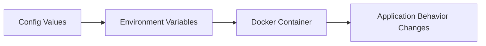
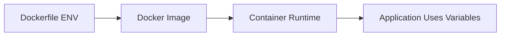
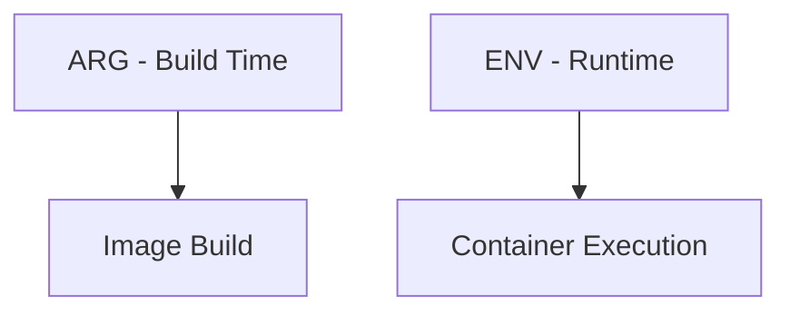
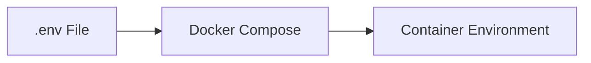
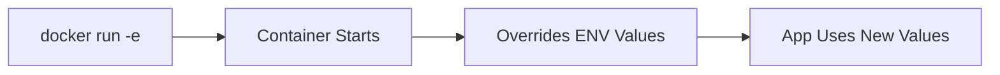
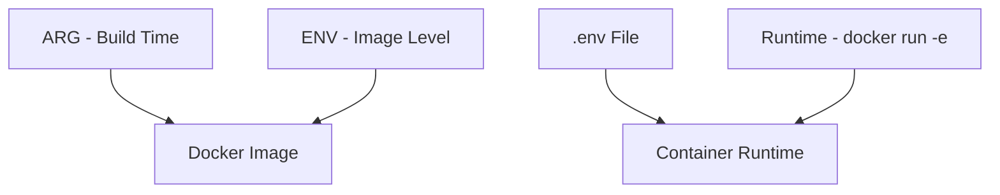

# 🐳 10. Environment Variables — Complete Guide

---

# 📖 What are Environment Variables?

Environment variables are **key-value pairs** used to configure applications without changing code.

They help make Docker applications:

- ⚙️ Configurable
- 🔒 Secure
- 🌍 Portable across environments

---

## 🎯 Why Environment Variables?

Without environment variables:

- ❌ Hardcoded values in code
- ❌ Different code for dev/prod
- ❌ Poor security (passwords in code)

With environment variables:

- ✅ Same image for all environments
- ✅ Easy configuration changes
- ✅ Better security
- ✅ CI/CD friendly

---

## 📊 Environment Variable Flow



---

# 🌐 ENV (Dockerfile)

---

# 📖 What is ENV?

`ENV` sets **environment variables inside a Docker image**.

These variables are available at **build time and runtime**.

---

## 🧾 Syntax

```dockerfile
ENV KEY=value
```

---

## 🧾 Example

```dockerfile
ENV NODE_ENV=production
ENV PORT=3000
```

---

## ❓ What it does

- Stored inside image
- Available inside container
- Used by application at runtime

---

## 🧪 Example Usage

```dockerfile
ENV NAME=DockerApp

CMD echo $NAME
```

---

## 📊 ENV Flow



---

# 🏷️ ARG (Build-time Variables)

---

# 📖 What is ARG?

`ARG` is used to define variables that are available **only during image build time**.

They are NOT available inside running containers.

---

## 🧾 Syntax

```dockerfile
ARG VERSION
```

---

## 🧾 Example

```dockerfile
ARG VERSION=1.0
FROM ubuntu:${VERSION}
```

---

## 🧾 Build Example

```bash
docker build --build-arg VERSION=22.04 .
```

---

## ❓ What it does

- Used during build only
- Helps customize image creation
- Not stored in final container

---

## 📊 ARG Flow


---

## ⚠️ ARG Limitation

| Feature | ARG | ENV |
|----------|-----|-----|
| Build time | ✅ | ❌ |
| Runtime | ❌ | ✅ |
| Available in container | ❌ | ✅ |

---

# ⚖️ Build-time vs Runtime Variables

---

## 📖 Key Difference

Docker separates variables into two categories:

- 🏗️ Build-time → ARG
- ▶️ Runtime → ENV / .env

---

## 📊 Comparison Table

| Feature | ARG | ENV |
|----------|-----|-----|
| Used during build | ✅ | ❌ |
| Used in running container | ❌ | ✅ |
| Stored in image | ❌ | ✅ |
| Best use case | Image customization | App configuration |

---

## 🧠 Example

```dockerfile
ARG VERSION=3.12
FROM python:${VERSION}

ENV APP_ENV=production
```

---

## 📊 Flow



---

# 📄 .env FILE

---

# 📖 What is .env?

`.env` is a file used to store environment variables outside the Dockerfile.

It is commonly used with Docker Compose.

---

## 🧾 Example .env File

```env
NODE_ENV=production
PORT=3000
DB_HOST=database
DB_USER=root
DB_PASSWORD=secret
```

---

## 🧾 Usage in Docker Compose

```yaml
services:
  app:
    image: node
    env_file:
      - .env
```

---

## ❓ What it does

- Loads variables into container
- Keeps configuration outside code
- Easy environment switching

---

## 📊 .env Flow



---

# 🔄 Runtime Variables

---

# 📖 What are Runtime Variables?

Runtime variables are passed **when the container starts**, not when the image is built.

---

## 🧾 Using `-e` flag

```bash
docker run -e NODE_ENV=production node
```

---

## 🧾 Multiple variables

```bash
docker run \
-e NODE_ENV=production \
-e PORT=3000 \
node
```

---

## ❓ What it does

- Overrides ENV values
- Temporary configuration
- Useful for testing

---

## 📊 Runtime Flow



---

# ⚖️ ENV vs ARG vs .env vs Runtime

---

## 📊 Full Comparison

| Type | When Used | Stored | Scope | Example |
|------|----------|--------|-------|---------|
| ARG | Build time | ❌ | Build only | VERSION |
| ENV | Build + Runtime | ✅ | Container | PORT |
| .env | Compose runtime | External | Project | DB_PASSWORD |
| Runtime (-e) | Run time | ❌ | Temporary | NODE_ENV |

---

# 🧪 REAL WORLD EXAMPLE

---

## 🐳 Dockerfile

```dockerfile
FROM node:18

ARG VERSION=1.0

WORKDIR /app

COPY . .

ENV NODE_ENV=production
ENV PORT=3000

CMD ["node", "app.js"]
```

---

## 🧾 .env file

```env
PORT=4000
NODE_ENV=development
```

---

## 🧾 Docker Compose

```yaml
services:
  app:
    build: .
    env_file:
      - .env
    ports:
      - "4000:4000"
```

---

## 🧪 Runtime override

```bash
docker run -e PORT=5000 myapp
```

---

# 📊 COMPLETE FLOW



---

# ⚠️ COMMON ISSUES

---

## ❌ ENV not updating

✔ Fix:

Rebuild image:

```bash
docker build --no-cache .
```

---

## ❌ .env not loaded

✔ Fix:

Ensure:

```yaml
env_file:
  - .env
```

---

## ❌ ARG not available in container

✔ Expected behavior (ARG is build-only)

---

# 📌 KEY TAKEAWAYS

- 🌐 ENV is used for runtime configuration
- 🏷️ ARG is used for build-time customization
- 📄 .env is used with Docker Compose
- 🔄 Runtime variables override ENV values
- ⚖️ Each variable type has a different scope

---

# 📚 SUMMARY

Environment variables are essential for building flexible Docker applications.

In this chapter, you learned:

- ENV (runtime configuration inside image)
- ARG (build-time variables)
- .env file (external configuration)
- Runtime variables (-e flag)
- Differences between all variable types

Using them correctly makes Docker applications **secure, flexible, and production-ready**.

---