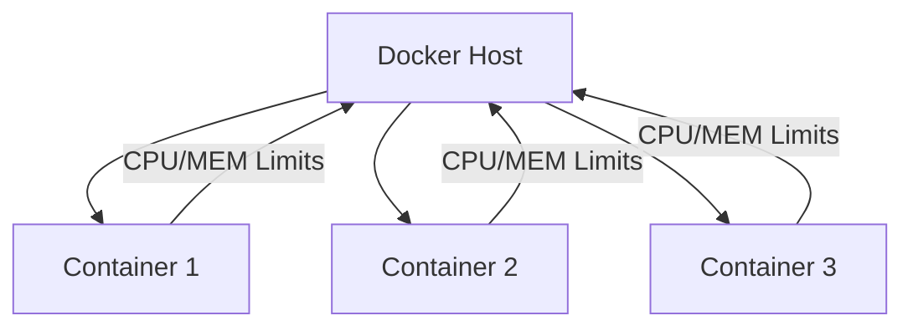
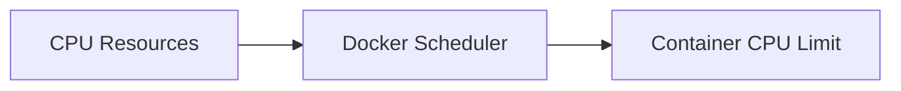
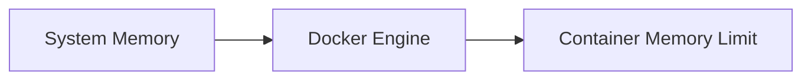
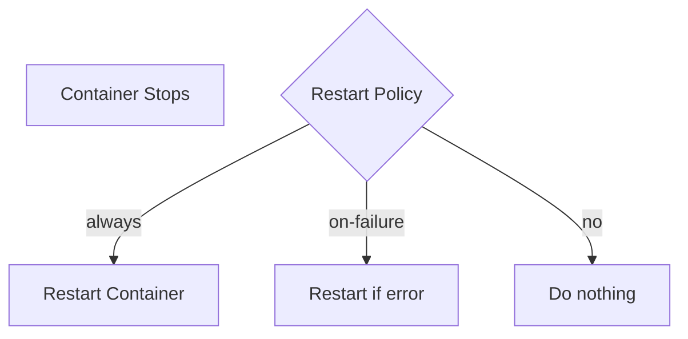
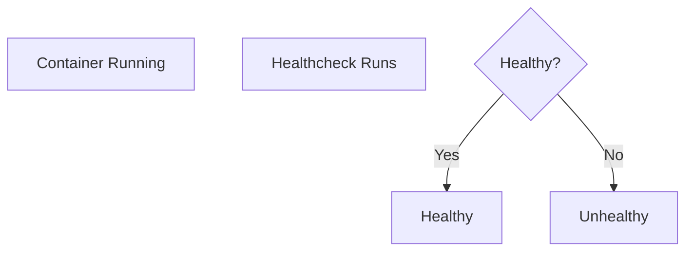
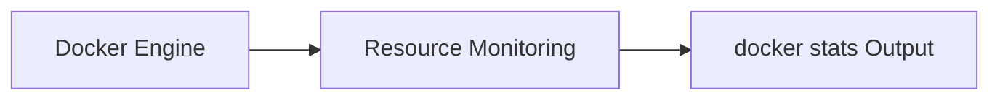

# 🐳 11. Resource Management — Complete Guide

---

# 📖 What is Docker Resource Management?

Docker Resource Management controls how much **CPU, memory, and system resources** a container can use.

It helps ensure:

- ⚖️ Fair resource usage between containers  
- 🚀 Better performance stability  
- 🛡️ Protection from resource exhaustion  
- 📊 Predictable application behavior  

---

## 🎯 Why Resource Management is Important?

Without limits:

- ❌ One container can consume all CPU
- ❌ Memory leaks can crash the host
- ❌ Other containers may slow down
- ❌ System instability

With limits:

- ✅ Controlled performance
- ✅ Safe multi-container environments
- ✅ Production-grade stability

---

## 📊 Resource Management Overview



---

# 🧠 CPU Limits

---

# 📖 What are CPU Limits?

CPU limits control how much **processor power** a container can use.

---

## 🧾 Syntax

```bash
docker run --cpus=<value> image
```

---

## 🧾 Example

```bash
docker run --cpus=1.5 nginx
```

---

## ❓ What it does

- Limits container to 1.5 CPU cores
- Prevents CPU overuse
- Ensures fair scheduling

---

## 📊 CPU Flow



---

## ⚠️ Alternative CPU Options

```bash
--cpu-shares
--cpuset-cpus
```

Example:

```bash
docker run --cpuset-cpus="0,1" nginx
```

---

# 🧠 Memory Limits

---

# 📖 What are Memory Limits?

Memory limits restrict how much **RAM a container can use**.

---

## 🧾 Syntax

```bash
docker run -m <memory> image
```

---

## 🧾 Example

```bash
docker run -m 512m nginx
```

---

## ❓ What it does

- Limits container memory usage to 512MB
- Prevents system crashes
- Helps avoid OOM (Out of Memory) errors

---

## 📊 Memory Flow



---

## ⚠️ Memory Options

| Flag | Description |
|------|------------|
| -m | Memory limit |
| --memory-swap | Total memory + swap |
| --oom-kill-disable | Prevent kill on memory overload |

---

# 🔁 Restart Policies

---

# 📖 What are Restart Policies?

Restart policies define **how containers behave when they stop or crash**.

---

## 🧾 Syntax

```bash
docker run --restart <policy> image
```

---

## 🧾 Example

```bash
docker run --restart always nginx
```

---

## 🔁 Restart Options

| Policy | Description |
|--------|------------|
| no | Do not restart |
| always | Always restart container |
| on-failure | Restart only on error |
| unless-stopped | Restart unless manually stopped |

---

## 📊 Restart Flow



---

## 🎯 Best Practice

Use:

```bash
--restart unless-stopped
```

for production.

---

# ❤️ Health Checks

---

# 📖 What is a Health Check?

A health check monitors whether a container is **working correctly or not**.

---

## 🧾 Syntax (Docker Run)

Health checks are usually defined in Dockerfile:

```dockerfile
HEALTHCHECK CMD curl -f http://localhost || exit 1
```

---

## 🧾 Example

```dockerfile
HEALTHCHECK --interval=30s --timeout=10s --retries=3 \
CMD curl -f http://localhost || exit 1
```

---

## ❓ What it does

- Checks container health periodically
- Marks container as:
  - 🟢 healthy
  - 🔴 unhealthy
- Helps detect failures early

---

## 📊 Health Status Flow



---

## 🧪 Status Check

```bash
docker ps
```

Output:

```text
Up (healthy)
Up (unhealthy)
```

---

# 📊 docker stats

---

# 📖 What is docker stats?

`docker stats` shows **real-time resource usage** of running containers.

---

## 🧾 Syntax

```bash
docker stats
```

---

## 🧾 Example Output

```text
CONTAINER   CPU %   MEM USAGE / LIMIT   MEM %   NET I/O
web         2.5%    120MiB / 1GiB       12%     1.2kB / 0B
db          5.0%    300MiB / 2GiB       15%     2kB / 1kB
```

---

## ❓ What it shows

- CPU usage
- Memory usage
- Network I/O
- Block I/O
- Container IDs

---

## 📊 Stats Flow



---

## 🎯 Use Cases

- Performance monitoring
- Debugging high CPU usage
- Memory leak detection
- Production monitoring

---

# 📊 RESOURCE MANAGEMENT SUMMARY TABLE

| Feature | Purpose |
|--------|--------|
| CPU Limits | Control processor usage |
| Memory Limits | Control RAM usage |
| Restart Policies | Handle failures automatically |
| Health Checks | Monitor container health |
| docker stats | Real-time monitoring |

---

# ⚠️ COMMON ISSUES

---

## ❌ Container killed (OOM error)

✔ Fix:

Increase memory:

```bash
docker run -m 1g image
```

---

## ❌ Container keeps restarting

✔ Fix:

Check logs:

```bash
docker logs <container>
```

---

## ❌ High CPU usage

✔ Fix:

Set CPU limits:

```bash
--cpus=1
```

---

# 📌 KEY TAKEAWAYS

- 🧠 CPU limits control processing power
- 🧠 Memory limits prevent system crashes
- 🔁 Restart policies ensure availability
- ❤️ Health checks monitor container health
- 📊 docker stats provides real-time monitoring

---

# 📚 SUMMARY

Docker Resource Management ensures containers run efficiently and safely.

In this chapter, you learned:

- CPU limiting techniques
- Memory constraints
- Restart policies
- Health monitoring
- Real-time stats monitoring

These tools are essential for **production-grade Docker systems**.

---