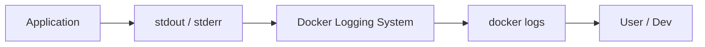
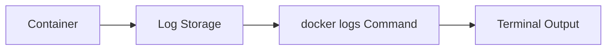
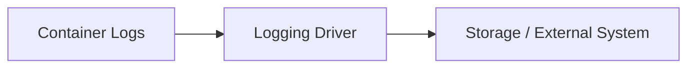
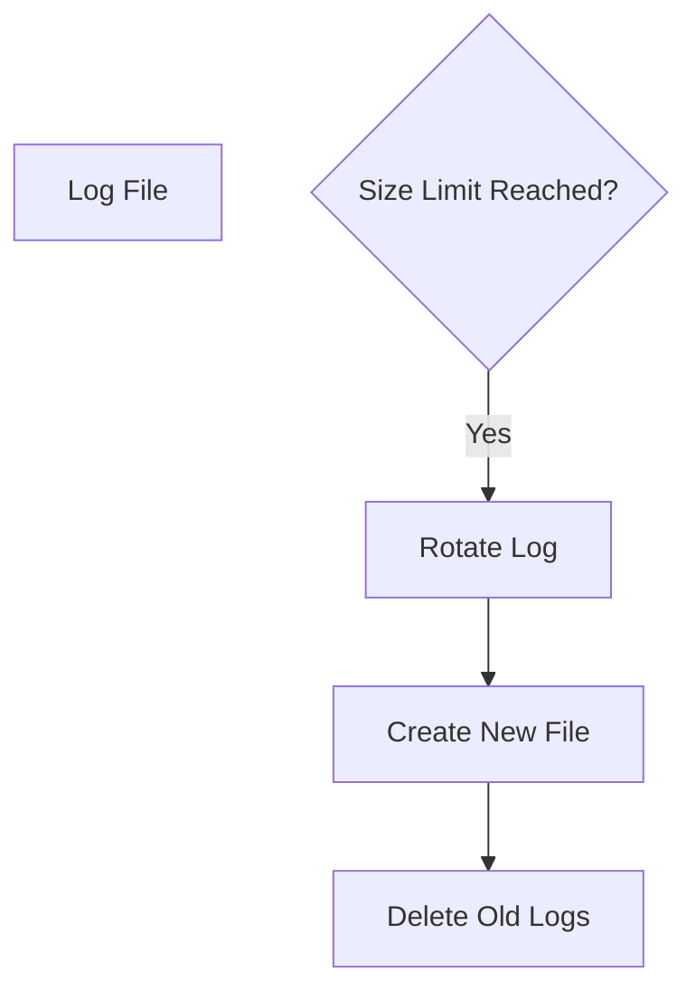
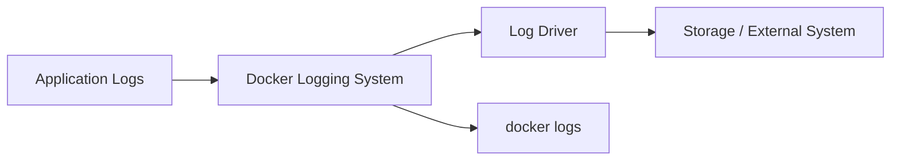

# 🐳 12. Docker Logging — Complete Guide

---

# 📖 What is Docker Logging?

Docker Logging is the mechanism used to **capture, store, and view container output logs**.

Containers generate logs from:

- 🖨️ Application output (stdout)
- ⚠️ Errors (stderr)
- 🧠 System messages

Docker collects these logs automatically.

---

## 🎯 Why Docker Logging is Important?

Without logging:

- ❌ Cannot debug container issues
- ❌ Hard to trace errors
- ❌ No visibility into application behavior

With logging:

- ✅ Easy debugging
- ✅ Real-time monitoring
- ✅ Production observability
- ✅ Centralized troubleshooting

---

## 📊 Logging Flow



---

# 📜 docker logs

---

# 📖 What is docker logs?

`docker logs` is used to view the logs generated by a running or stopped container.

---

## 🧾 Syntax

```bash
docker logs <container-id>
```

---

## 🧾 Example

```bash
docker logs my-container
```

---

## ❓ What it does

- Shows container output
- Displays application logs
- Helps debug issues

---

## 📊 Logs Flow



---

## 🔁 Follow Logs in Real Time

```bash
docker logs -f <container-id>
```

---

## 🧾 Example

```bash
docker logs -f web
```

---

## 🧪 Output Example

```text
Server started on port 3000
Database connected
GET /api/users 200
```

---

## ⏱️ Show Last Logs

```bash
docker logs --tail 10 <container>
```

---

## 📌 Add Timestamp

```bash
docker logs -t <container>
```

---

# ⚙️ Logging Drivers

---

# 📖 What are Logging Drivers?

Logging drivers define **how Docker stores and handles logs**.

Docker supports multiple logging mechanisms.

---

## 🧾 Default Logging Driver

```text
json-file
```

---

## 🧾 Syntax

```bash
docker run --log-driver <driver> image
```

---

## 🧾 Example

```bash
docker run --log-driver json-file nginx
```

---

## 📊 Common Logging Drivers

| Driver | Description |
|--------|------------|
| json-file | Default, stores logs locally |
| none | Disables logging |
| syslog | Sends logs to system logger |
| journald | Uses systemd journal |
| fluentd | Sends logs to Fluentd |
| awslogs | Sends logs to AWS CloudWatch |

---

## 📦 Example: Disable Logging

```bash
docker run --log-driver none nginx
```

---

## 📊 Logging Driver Flow



---

## 🎯 Best Practice

Use centralized logging in production:

- Fluentd
- ELK stack
- CloudWatch

---

# 🔁 Log Rotation

---

# 📖 What is Log Rotation?

Log rotation prevents logs from **growing infinitely** and consuming disk space.

---

## ❓ Why Log Rotation is Needed?

Without rotation:

- ❌ Disk space fills up
- ❌ System crashes
- ❌ Performance issues

With rotation:

- ✅ Controlled log size
- ✅ Old logs removed
- ✅ System stability

---

## 🧾 Syntax

```bash
docker run \
--log-opt max-size=10m \
--log-opt max-file=3 \
nginx
```

---

## 🧾 Example Explained

- max-size=10m → each log file max 10MB
- max-file=3 → keep only 3 log files

---

## 📊 Log Rotation Flow



---

## 🧪 Example Full Command

```bash
docker run -d \
--name web \
--log-driver json-file \
--log-opt max-size=5m \
--log-opt max-file=2 \
nginx
```

---

# 📊 LOGGING ARCHITECTURE



---

# ⚠️ COMMON ISSUES

---

## ❌ No logs showing

✔ Fix:

Check container status:

```bash
docker ps -a
```

---

## ❌ Logs too large

✔ Fix:

Enable log rotation:

```bash
--log-opt max-size=10m
```

---

## ❌ Logs missing in production

✔ Fix:

Check logging driver:

```bash
docker inspect <container>
```

---

## ❌ Real-time logs not working

✔ Fix:

Use follow flag:

```bash
docker logs -f <container>
```

---

# 📌 KEY TAKEAWAYS

- 📜 docker logs shows container output
- ⚙️ Logging drivers control log storage behavior
- 🔁 Log rotation prevents disk overflow
- 📡 Logs come from stdout and stderr
- 🧠 Proper logging is essential for debugging and monitoring

---

# 📚 SUMMARY

Docker Logging provides visibility into container behavior and application output.

In this chapter, you learned:

- How to view logs using `docker logs`
- How logging drivers work
- How to configure log rotation
- How Docker handles log storage internally

Proper logging is essential for **debugging, monitoring, and production stability**.

---