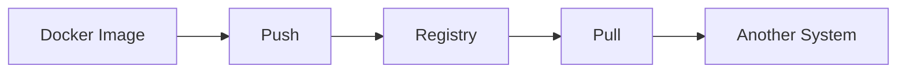
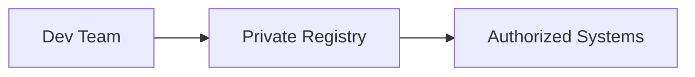
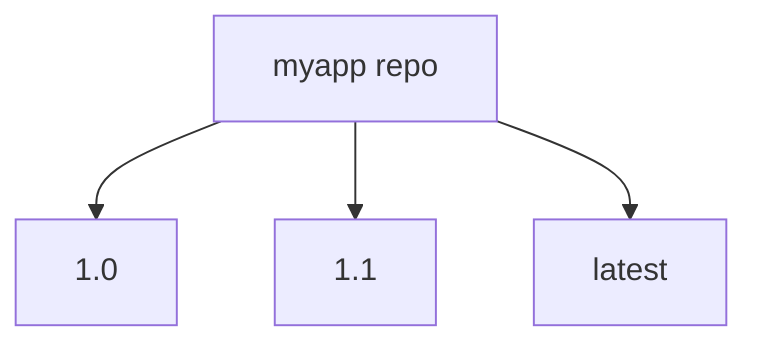
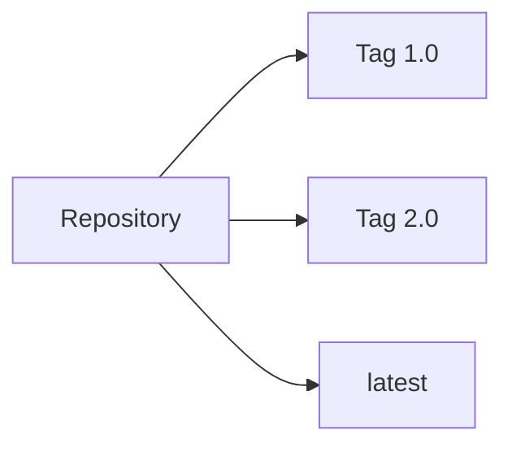
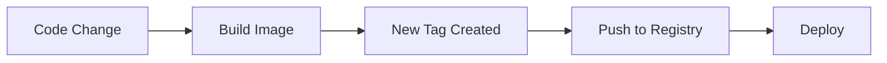
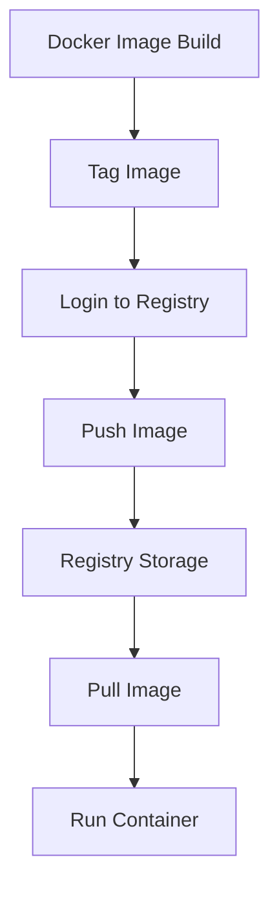

# 🐳 13. Docker Hub & Registries — Complete Guide

---

# 📖 What is a Docker Registry?

A Docker Registry is a **storage system for Docker images**.

It allows you to:

- 📦 Store images
- 📥 Pull images
- 📤 Push images
- 🌍 Share containers across systems

---

## 🎯 Why Registries are Important?

Without registries:

- ❌ Images stay only on local machine
- ❌ No sharing across teams
- ❌ No deployment pipeline

With registries:

- ✅ Global image distribution
- ✅ CI/CD integration
- ✅ Version control for images
- ✅ Scalable deployments

---

## 📊 Registry Workflow



---

# 🌍 Public Registry

---

# 📖 What is a Public Registry?

A public registry is a **free and open platform** where Docker images are shared publicly.

The most popular public registry is:

- 🐳 Docker Hub

---

## 🧾 Example Usage

```bash
docker pull nginx
```

This pulls from:

```text
Docker Hub (default registry)
```

---

## ❓ What it does

- Publicly available images
- Anyone can download
- No authentication required (for public repos)

---

## 📊 Public Registry Flow


---

## ⚠️ Limitations

- ❌ Rate limits (free tier)
- ❌ Public visibility
- ❌ Security concerns for sensitive images

---

# 🔐 Private Registry

---

# 📖 What is a Private Registry?

A private registry is a **secure storage system for Docker images**.

Only authorized users can access it.

---

## 🧾 Example Options

- Docker Hub Private Repos
- AWS ECR
- Azure Container Registry
- Google Artifact Registry

---

## 🧾 Login Example

```bash
docker login
```

---

## 🧾 Push to Private Repo

```bash
docker push myuser/myapp:1.0
```

---

## ❓ What it does

- Secures sensitive images
- Restricts access
- Used in production systems

---

## 📊 Private Registry Flow



---

## 🎯 When to use

- Enterprise applications
- Internal tools
- Production environments
- Secure microservices

---

# 📦 Repository Management

---

# 📖 What is a Repository?

A repository is a **collection of Docker images with the same name but different versions (tags)**.

---

## 🧾 Example

```text
myapp:1.0
myapp:1.1
myapp:latest
```

---

## ❓ What it does

- Organizes images
- Supports versioning
- Helps manage releases

---

## 📊 Repository Structure



---

## 🧾 Docker Hub Example

```text
username/myapp
```

---

# 🏷️ Tags

---

# 📖 What are Tags?

Tags are used to define **versions of Docker images** inside a repository.

---

## 🧾 Syntax

```bash
image:tag
```

---

## 🧾 Example

```bash
nginx:latest
nginx:1.25
nginx:stable
```

---

## ❓ What it does

- Identifies image versions
- Helps rollback changes
- Enables environment separation

---

## 📊 Tag Flow



---

## ⚠️ Best Practice

Avoid using only:

```text
latest
```

Prefer versioned tags:

```text
1.0
1.1
2.0
```

---

# 🔁 Versioning

---

# 📖 What is Versioning?

Versioning is the process of assigning **structured versions to Docker images**.

---

## 🧾 Example Strategy

```text
myapp:1.0.0
myapp:1.0.1
myapp:1.1.0
myapp:2.0.0
```

---

## ❓ Why versioning matters

- 🔄 Rollback support
- 🚀 CI/CD pipelines
- 🧪 Testing stability
- 📦 Production safety

---

## 📊 Versioning Flow



---

# 📤 Docker Hub Workflow

---

## 🧾 Login

```bash
docker login
```

---

## 🧾 Tag Image

```bash
docker tag myapp:1.0 user/myapp:1.0
```

---

## 🧾 Push Image

```bash
docker push user/myapp:1.0
```

---

## 🧾 Pull Image

```bash
docker pull user/myapp:1.0
```

---

# 📊 END-TO-END WORKFLOW



---

# ⚠️ COMMON ISSUES

---

## ❌ Push denied

✔ Fix:

```bash
docker login
```

---

## ❌ Repository not found

✔ Fix:

Ensure correct naming:

```text
username/repository:tag
```

---

## ❌ Rate limit exceeded (Docker Hub)

✔ Fix:

- Login to Docker Hub
- Use private registry
- Use caching

---

# 📌 KEY TAKEAWAYS

- 🌍 Registries store and distribute Docker images
- 🐳 Docker Hub is the default public registry
- 🔐 Private registries secure sensitive images
- 📦 Repositories group related images
- 🏷️ Tags define image versions
- 🔁 Versioning ensures stable deployments

---

# 📚 SUMMARY

Docker registries are essential for sharing and managing container images.

In this chapter, you learned:

- Public vs private registries
- Repository structure
- Tagging strategy
- Image versioning
- Push/pull workflow
- Docker Hub usage

This completes the full image distribution lifecycle in Docker.

---