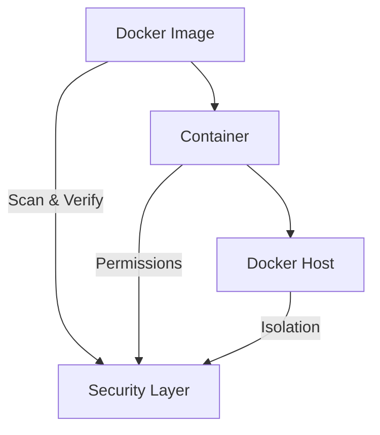
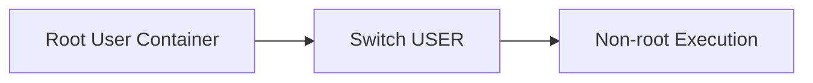
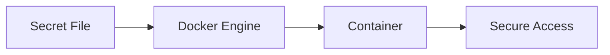
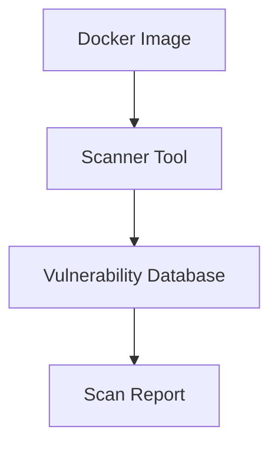
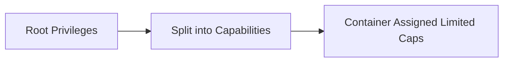
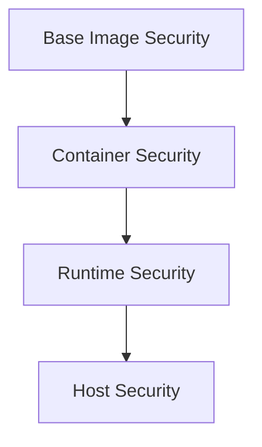

# 🐳 14. Docker Security — Complete Guide

---

# 📖 What is Docker Security?

Docker Security is the practice of protecting **containers, images, and the Docker host** from vulnerabilities and unauthorized access.

It ensures:

- 🔒 Safe container execution
- 🛡️ Protection from attacks
- 🔐 Secure secrets handling
- 🚫 Reduced system exposure

---

## 🎯 Why Docker Security is Important?

Without security:

- ❌ Containers can run as root
- ❌ Sensitive data may leak
- ❌ Vulnerable images may be deployed
- ❌ Host system can be compromised

With security:

- ✅ Controlled access
- ✅ Minimal privileges
- ✅ Secure deployments
- ✅ Production-grade safety

---

## 📊 Security Overview



---

# 👤 Root vs Non-root Users

---

# 📖 What is Root User in Docker?

By default, Docker containers run as the **root user**.

This means:

- Full system access inside container
- High risk if compromised

---

## ⚠️ Problem with Root

- ❌ Can modify system files
- ❌ Can escalate privileges
- ❌ Security vulnerability in production

---

# 👤 Non-root User

---

# 📖 What is Non-root User?

A non-root user runs the container with **limited permissions**.

---

## 🧾 Example (Dockerfile)

```dockerfile
RUN useradd appuser
USER appuser
```

---

## ❓ Benefits

- 🔒 Reduced attack surface
- 🛡️ Limited access to system
- 🚀 Safer production deployments

---

## 📊 User Flow



---

## 🎯 Best Practice

Always use non-root users in production:

```dockerfile
USER 1001
```

---

# 🔐 Secrets Management

---

# 📖 What are Docker Secrets?

Secrets are used to store **sensitive information securely**.

Examples:

- Passwords
- API keys
- Certificates

---

## 🧾 Docker Compose Secrets Example

```yaml
secrets:
  db_password:
    file: db_password.txt
```

---

## 🧾 Using Secret in Service

```yaml
services:
  db:
    image: mysql
    secrets:
      - db_password
```

---

## ❓ What it does

- Stores sensitive data securely
- Prevents exposure in images
- Used in Swarm / production setups

---

## 📊 Secrets Flow



---

## ⚠️ Important Note

Do NOT use ENV for secrets:

```bash
ENV PASSWORD=12345 ❌
```

---

# 🧪 Image Scanning

---

# 📖 What is Image Scanning?

Image scanning checks Docker images for **security vulnerabilities**.

---

## 🧾 Example Command

```bash
docker scan myimage
```

---

## ❓ What it does

- Detects known vulnerabilities (CVEs)
- Analyzes dependencies
- Checks base image risks

---

## 📊 Scanning Flow



---

## 🧪 Example Output

```text
High severity vulnerability found in openssl
Medium severity in libc
```

---

## 🎯 Best Practice

- Always scan images before production
- Use minimal base images
- Keep dependencies updated

---

# 🧠 Capabilities

---

# 📖 What are Linux Capabilities?

Linux capabilities split root privileges into smaller permissions.

Docker allows controlling these permissions.

---

## 🧾 Example

```bash
docker run --cap-drop ALL nginx
```

---

## 🧾 Add Specific Capability

```bash
docker run --cap-add NET_ADMIN nginx
```

---

## ❓ What it does

- Limits container privileges
- Reduces attack surface
- Improves isolation

---

## 📊 Capabilities Flow



---

## ⚠️ Common Capabilities

| Capability | Purpose |
|------------|--------|
| NET_ADMIN | Network control |
| SYS_TIME | System time changes |
| CHOWN | Change file ownership |

---

# 🛡️ Security Best Practices

---

## 🚀 1. Use Non-root Users

```dockerfile
USER appuser
```

---

## 🚀 2. Use Minimal Base Images

```dockerfile
FROM alpine
```

---

## 🚀 3. Scan Images Regularly

```bash
docker scan image
```

---

## 🚀 4. Avoid Hardcoded Secrets

❌ Bad:

```dockerfile
ENV PASSWORD=1234
```

✔ Good:

Use secrets or env files

---

## 🚀 5. Limit Capabilities

```bash
--cap-drop ALL
```

---

## 🚀 6. Use Read-only Containers

```bash
docker run --read-only nginx
```

---

## 🚀 7. Keep Docker Updated

Regular updates fix vulnerabilities.

---

## 🚀 8. Use Trusted Images

Prefer:

- Official Docker Hub images
- Verified publishers

---

# 📊 SECURITY LAYERS MODEL



---

# ⚠️ COMMON SECURITY MISTAKES

---

## ❌ Running everything as root

✔ Fix: use USER directive

---

## ❌ Storing secrets in ENV

✔ Fix: use Docker secrets

---

## ❌ Using unscanned images

✔ Fix:

```bash
docker scan image
```

---

## ❌ Using full privileges

✔ Fix:

```bash
--cap-drop ALL
```

---

# 📌 KEY TAKEAWAYS

- 👤 Root containers are risky
- 🔐 Secrets must be securely managed
- 🧪 Image scanning detects vulnerabilities
- 🧠 Capabilities limit permissions
- 🛡️ Security best practices ensure production safety

---

# 📚 SUMMARY

Docker Security ensures safe containerized applications.

In this chapter, you learned:

- Root vs non-root users
- Secure secrets handling
- Image vulnerability scanning
- Linux capabilities control
- Best security practices

Security is essential for **production-ready Docker systems**.

---