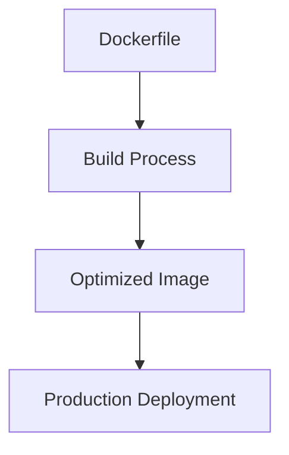
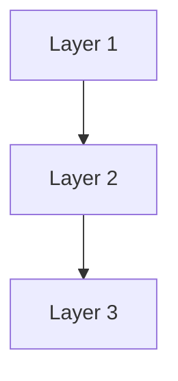
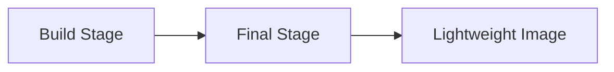
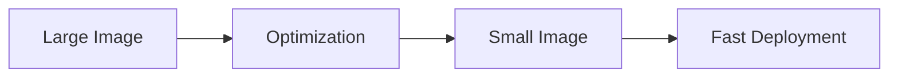
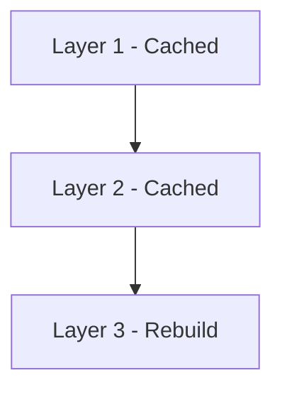
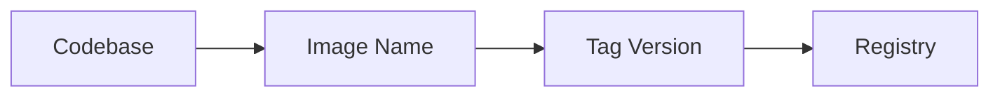
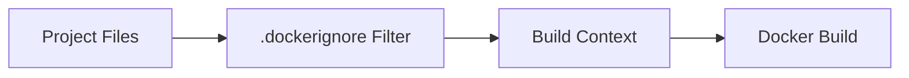
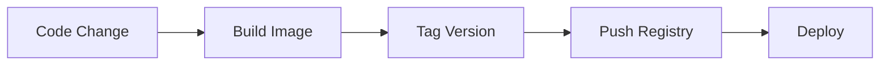
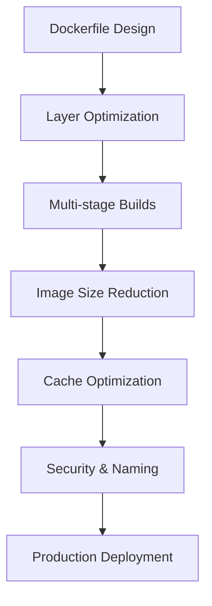

# 🐳 15. Docker Best Practices — Complete Guide

---

# 📖 What are Docker Best Practices?

Docker Best Practices are a set of **guidelines and techniques** used to build:

- ⚡ Faster images  
- 📦 Smaller images  
- 🔒 Secure containers  
- 🚀 Production-ready deployments  

---

## 🎯 Why Best Practices Matter?

Without best practices:

- ❌ Large image sizes
- ❌ Slow builds
- ❌ Security risks
- ❌ Hard-to-maintain Dockerfiles

With best practices:

- ✅ Optimized images
- ✅ Faster CI/CD pipelines
- ✅ Secure deployments
- ✅ Clean architecture

---

## 📊 Best Practices Overview



---

# 🧱 Layer Optimization

---

# 📖 What is Layer Optimization?

Docker images are built in **layers**, and each instruction creates a layer.

Optimizing layers reduces:

- 📦 Image size
- ⚡ Build time

---

## 🧾 Bad Example

```dockerfile
RUN apt update
RUN apt install -y curl
RUN apt install -y git
```

---

## 🧾 Good Example

```dockerfile
RUN apt update && apt install -y curl git
```

---

## ❓ Why it works

- Fewer layers
- Better caching
- Faster builds

---

## 📊 Layer Flow



---

# 🧪 Multi-stage Builds

---

# 📖 What is Multi-stage Build?

Multi-stage builds allow you to use **multiple FROM statements** to create optimized images.

---

## 🧾 Example

```dockerfile
# Build stage
FROM node:18 AS builder
WORKDIR /app
COPY . .
RUN npm install && npm run build

# Production stage
FROM nginx:alpine
COPY --from=builder /app/build /usr/share/nginx/html
```

---

## ❓ What it does

- Separates build and runtime
- Removes unnecessary files
- Produces smaller images

---

## 📊 Multi-stage Flow



---

## 🎯 Benefit

- Smaller production images
- Cleaner runtime environment

---

# 📦 Image Size Optimization

---

# 📖 Why Optimize Image Size?

Smaller images:

- ⚡ Pull faster
- 🚀 Deploy faster
- 💾 Use less storage
- 🔒 Reduce attack surface

---

## 🧾 Techniques

### ✔ Use minimal base images

```dockerfile
FROM alpine
```

---

### ✔ Remove unnecessary files

```dockerfile
RUN apt clean && rm -rf /var/lib/apt/lists/*
```

---

### ✔ Use multi-stage builds

(Already covered above)

---

## 📊 Size Optimization Flow



---

# ⚡ Build Cache Optimization

---

# 📖 What is Build Cache?

Docker reuses previous build layers to speed up builds.

---

## 🧾 Good Order Example

```dockerfile
COPY package.json .
RUN npm install
COPY . .
```

---

## ❌ Bad Order Example

```dockerfile
COPY . .
RUN npm install
```

---

## ❓ Why order matters

- Changes in early layers invalidate cache
- Proper order improves build speed

---

## 📊 Cache Flow



---

# 🏷️ Naming Conventions

---

# 📖 Why Naming Matters?

Proper naming improves:

- 📦 Image management
- 🚀 CI/CD pipelines
- 🧠 Readability

---

## 🧾 Good Naming Example

```text
myapp-backend:1.0.0
myapp-frontend:1.0.0
```

---

## ❌ Bad Naming Example

```text
app
test
final
latest1
```

---

## 🎯 Best Practice

Use:

```text
<project>-<service>:<version>
```

---

## 📊 Naming Flow



---

# 🚫 .dockerignore

---

# 📖 What is .dockerignore?

`.dockerignore` excludes unnecessary files from build context.

---

## 🧾 Example

```text
node_modules
.git
.env
dist
*.log
```

---

## ❓ Why it matters

- Reduces build size
- Improves security
- Speeds up builds

---

## 📊 Flow



---

# 🔁 Versioning

---

# 📖 What is Versioning?

Versioning tracks changes in Docker images using tags.

---

## 🧾 Example

```text
myapp:1.0.0
myapp:1.1.0
myapp:2.0.0
```

---

## ❓ Why versioning is important

- 🔄 Rollback support
- 🚀 CI/CD integration
- 🧪 Stable deployments
- 📦 Change tracking

---

## 📊 Version Flow



---

# 📊 FULL DOCKER BEST PRACTICES MODEL



---

# ⚠️ COMMON MISTAKES

---

## ❌ Using latest tag

✔ Fix:

```text
nginx:1.25
```

---

## ❌ Not using .dockerignore

✔ Fix: add ignored files

---

## ❌ Large images

✔ Fix: use alpine + multi-stage builds

---

## ❌ Poor layer ordering

✔ Fix: optimize Dockerfile structure

---

# 📌 KEY TAKEAWAYS

- 🧱 Optimize Docker layers for speed
- 🧪 Use multi-stage builds for smaller images
- 📦 Reduce image size for performance
- ⚡ Use build cache efficiently
- 🏷️ Follow proper naming conventions
- 🚫 Always use .dockerignore
- 🔁 Use proper versioning strategy

---

# 📚 SUMMARY

Docker Best Practices ensure your containers are:

- Fast ⚡
- Secure 🔒
- Lightweight 📦
- Maintainable 🧠
- Production-ready 🚀

---

👉 Following these practices is the difference between **basic Docker usage** and **real-world production systems**.