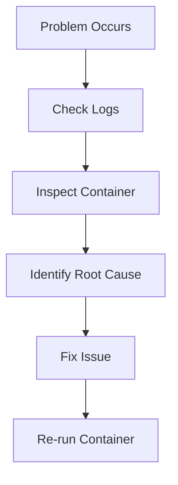
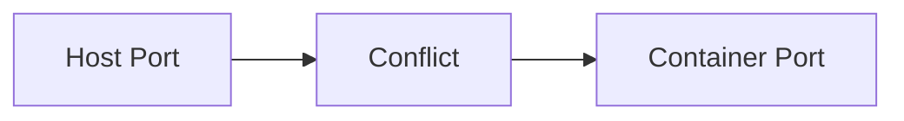
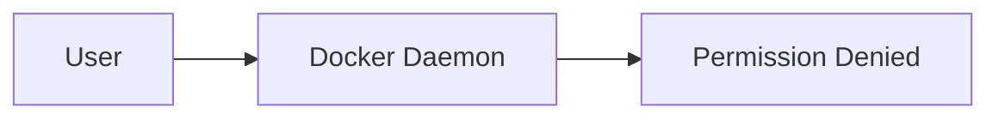
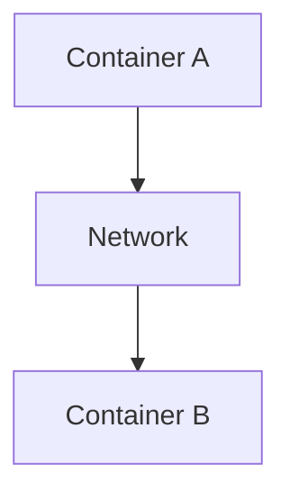
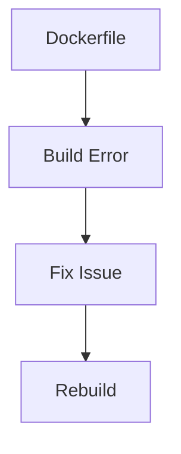
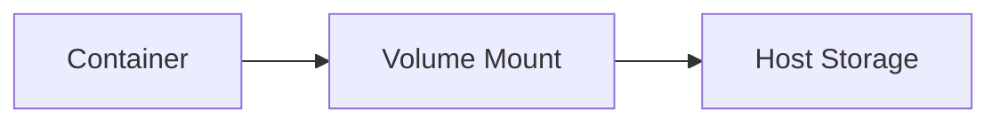
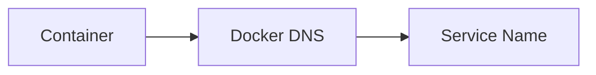
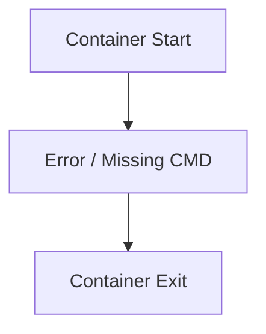

# 🐳 16. Docker Troubleshooting — Complete Guide

---

# 📖 What is Docker Troubleshooting?

Docker Troubleshooting is the process of identifying and fixing common issues in:

- 🧱 Containers
- 📦 Images
- 🌐 Networks
- 💾 Volumes
- ⚙️ Builds

---

## 🎯 Why Troubleshooting is Important?

Without troubleshooting skills:

- ❌ Containers feel “unreliable”
- ❌ Debugging takes too long
- ❌ Production issues become critical
- ❌ Logs and errors are confusing

With troubleshooting skills:

- ✅ Faster debugging
- ✅ Stable deployments
- ✅ Clear root-cause analysis
- ✅ Production confidence

---

## 📊 Troubleshooting Flow



---

# 🚪 Port Issues

---

# 📖 What are Port Issues?

Port issues occur when a container cannot bind or access a required port.

---

## ❌ Common Error

```text
port is already allocated
```

---

## 🧾 Cause

- Another process is using the same port
- Another container is already running
- Wrong port mapping

---

## 🧾 Fix

### ✔ Check running containers

```bash
docker ps
```

---

### ✔ Use different port

```bash
docker run -p 8081:80 nginx
```

---

### ✔ Kill process using port

```bash
lsof -i :8080
kill -9 <PID>
```

---

## 📊 Port Flow



---

# 🔐 Permission Issues

---

# 📖 What are Permission Issues?

These occur when Docker cannot access files or execute commands.

---

## ❌ Common Error

```text
Permission denied
```

---

## 🧾 Causes

- Running without sudo
- File ownership issues
- Docker daemon access restriction

---

## 🧾 Fix

### ✔ Add user to docker group

```bash
sudo usermod -aG docker $USER
newgrp docker
```

---

### ✔ Use sudo

```bash
sudo docker run nginx
```

---

### ✔ Fix file permissions

```bash
chmod 755 file
```

---

## 📊 Permission Flow



---

# 🌐 Network Issues

---

# 📖 What are Network Issues?

Problems when containers cannot communicate with each other or outside world.

---

## ❌ Common Problems

- Cannot connect to API
- DNS resolution fails
- Container cannot reach internet

---

## 🧾 Fix

### ✔ Check networks

```bash
docker network ls
```

---

### ✔ Inspect network

```bash
docker network inspect bridge
```

---

### ✔ Use correct service name

```text
db:3306
```

---

## 📊 Network Flow



---

# 🏗️ Build Errors

---

# 📖 What are Build Errors?

Errors that occur during `docker build`.

---

## ❌ Common Errors

- COPY failed
- package not found
- syntax error in Dockerfile

---

## 🧾 Fix

### ✔ Check Dockerfile syntax

```dockerfile
FROM node:18
WORKDIR /app
COPY . .
RUN npm install
```

---

### ✔ Check build context

```bash
docker build -t app .
```

---

### ✔ Use no-cache build

```bash
docker build --no-cache -t app .
```

---

## 📊 Build Flow



---

# 💾 Volume Issues

---

# 📖 What are Volume Issues?

Problems with data persistence in containers.

---

## ❌ Common Issues

- Data not saving
- Volume not mounting
- Permission denied

---

## 🧾 Fix

### ✔ Check volumes

```bash
docker volume ls
```

---

### ✔ Inspect volume

```bash
docker volume inspect myvolume
```

---

### ✔ Correct mount path

```bash
docker run -v myvol:/data nginx
```

---

## 📊 Volume Flow



---

# 🌐 DNS Problems

---

# 📖 What are DNS Problems?

Containers cannot resolve service names.

---

## ❌ Common Error

```text
Could not resolve host
```

---

## 🧾 Fix

### ✔ Use service name instead of IP

```text
db
```

---

### ✔ Check Docker network

```bash
docker network inspect bridge
```

---

### ✔ Restart network

```bash
docker network prune
```

---

## 📊 DNS Flow



---

# 💥 Container Exit Problems

---

# 📖 What are Exit Problems?

Container stops immediately after starting.

---

## ❌ Common Exit Reasons

- Missing CMD
- App crashes
- Missing dependencies

---

## 🧾 Fix

### ✔ Check logs

```bash
docker logs <container>
```

---

### ✔ Run interactively

```bash
docker run -it ubuntu bash
```

---

### ✔ Ensure CMD exists

```dockerfile
CMD ["node", "app.js"]
```

---

## 📊 Exit Flow



---

# 📊 TROUBLESHOOTING TOOLKIT

```text
docker ps
docker logs
docker inspect
docker exec
docker network ls
docker volume ls
```

---

# ⚠️ COMMON DEBUGGING MISTAKES

---

## ❌ Ignoring logs

✔ Always check logs first

```bash
docker logs <container>
```

---

## ❌ Wrong port mapping

✔ Fix with:

```bash
-p host:container
```

---

## ❌ Using wrong service name

✔ Use Docker DNS names

---

## ❌ Not rebuilding image

✔ Fix:

```bash
docker build --no-cache .
```

---

# 📌 KEY TAKEAWAYS

- 🚪 Port conflicts block access
- 🔐 Permissions affect Docker access
- 🌐 Networking issues break communication
- 🏗️ Build errors come from Dockerfile or context
- 💾 Volume issues affect data persistence
- 🌍 DNS issues affect service discovery
- 💥 Exit issues usually mean app failure or missing CMD

---

# 📚 SUMMARY

Docker troubleshooting helps you quickly fix issues in real-world environments.

In this chapter, you learned:

- Common Docker errors
- Debugging techniques
- Log-based analysis
- Network and volume fixes
- Container lifecycle issues

Mastering troubleshooting is essential for **production-grade Docker usage**.

---