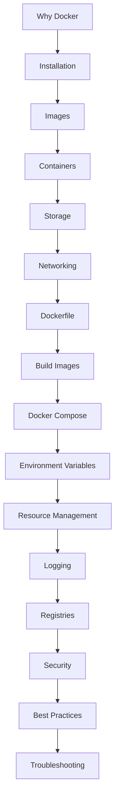
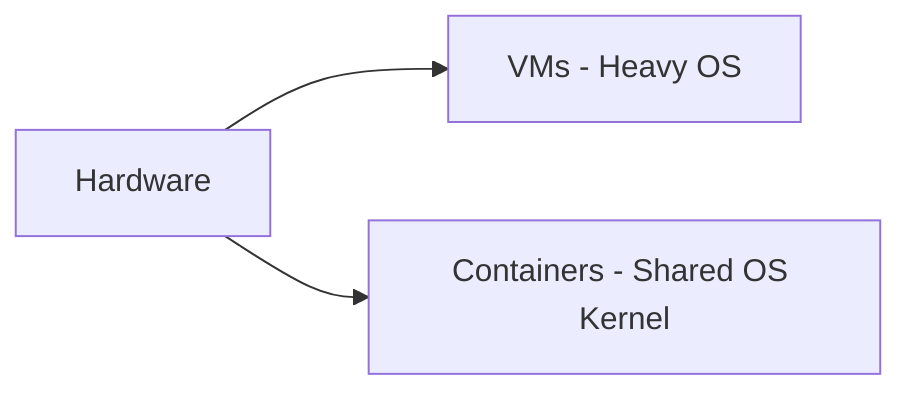

# 🐳 Docker Learning Journey — Complete Roadmap

Welcome to the **Docker Mastery Guide 🚀**  
This README is a structured learning path covering Docker from **zero to production-level expertise**.

---

# 📌 Learning Path Overview



---

# 🧠 01. Why Docker?

## 📦 Evolution of Software Deployment

- 🏢 Traditional deployment = manual setup
- 💥 Dependency hell = conflicting libraries
- 🧨 “Works on my machine” problem
- ⚠️ No standard environment

---

## 🖥️ Virtualization

- Physical servers 🏢
- Hypervisors 🧠
- Virtual Machines 💻
- Type 1 vs Type 2 hypervisors

### ❌ Limitations
- Heavy resource usage
- Slow startup
- OS duplication

### ✅ Advantages
- Isolation
- Multi-OS support

---

## 🐳 Why Containers?

- Lightweight alternative to VMs
- Share OS kernel
- Fast startup ⚡
- Portable across systems 🌍

---

## 📊 Containers vs VMs



---

## 🐳 What is Docker?

Docker is a platform that allows you to:

- 📦 Build applications
- 🚀 Ship applications
- 🏃 Run applications anywhere

---

## 🏗️ Docker Architecture

- Docker Client 💻
- Docker Engine ⚙️
- Docker Daemon 🔧
- Docker Registry 🌍
- Docker Hub 🐳

---

# ⚙️ 02. Docker Installation

- Install Docker Engine
- Verify installation
- Check version
- Docker system info
- Run hello-world container 👋

---

# 📦 03. Docker Images

## 📖 Concepts
- Images are read-only templates
- Built using layers
- Stored in Docker Hub

## 🧱 Lifecycle
Pull → Build → Tag → Push → Remove

---

## 🛠️ Hands-on
- Pull images
- Inspect images
- View history
- Save & load images

---

# 🐳 04. Docker Containers

## 📖 Concepts
- Running instance of image
- Has lifecycle: create → run → stop → delete

---

## 🧪 Hands-on Commands

```bash
docker run
docker ps
docker stop
docker start
docker exec
docker logs
docker rm
```

---

# 💾 05. Docker Storage

- Writable container layer
- Bind mounts
- Volumes 📦
- tmpfs (temporary storage)

---

## 🧪 Hands-on
- Create volumes
- Mount volumes
- Share volumes

---

# 🌐 06. Docker Networking

- Bridge network 🌉
- Host network 🖥️
- None network 🚫
- Overlay network 🌍

---

## 📡 Concepts
- Port mapping
- DNS resolution
- Service communication

---

# 🧾 07. Dockerfile

## 📖 Core Instructions

- FROM
- RUN
- CMD
- COPY
- ADD
- ENV
- ARG
- ENTRYPOINT
- EXPOSE
- LABEL
- USER
- VOLUME
- HEALTHCHECK

---

# 🏗️ 08. Building Images

- docker build
- Build context
- Layer cache ⚡
- .dockerignore 🚫
- Tagging & versioning 🏷️

---

## 🧪 Workflow

```bash
docker build -t myapp:1.0 .
docker tag myapp user/myapp:1.0
docker push user/myapp:1.0
```

---

# 🧩 09. Docker Compose

## 📖 Why Compose?

Run multi-container apps easily.

---

## 🧱 Core Concepts

- Services
- Networks
- Volumes
- Environment variables
- depends_on

---

## 🚀 Command

```bash
docker compose up -d
```

---

# 🌐 10. Environment Variables

- ENV (runtime config)
- ARG (build-time config)
- .env file 📄
- Runtime overrides (-e)

---

# ⚙️ 11. Resource Management

- CPU limits 🧠
- Memory limits 💾
- Restart policies 🔁
- Health checks ❤️
- docker stats 📊

---

# 📜 12. Docker Logging

- docker logs
- Logging drivers
- Log rotation 🔁

---

## 📊 Example

```bash
docker logs -f container
```

---

# 🌍 13. Docker Hub & Registries

- Public registry 🌍
- Private registry 🔐
- Repositories 📦
- Tags 🏷️
- Versioning 🔁

---

## 🚀 Workflow

Login → Tag → Push → Pull → Run

---

# 🔐 14. Docker Security

- Root vs non-root 👤
- Secrets 🔐
- Image scanning 🧪
- Capabilities 🧠
- Security best practices 🛡️

---

# 🚀 15. Docker Best Practices

- Layer optimization 🧱
- Multi-stage builds 🏗️
- Image size optimization 📦
- Cache usage ⚡
- Naming conventions 🏷️
- .dockerignore 🚫
- Versioning 🔁

---

# 🛠️ 16. Troubleshooting

## Common Issues

- Port conflicts 🚪
- Permission errors 🔐
- Network issues 🌐
- Build failures 🏗️
- Volume issues 💾
- DNS problems 🌍
- Container exit 💥

---

## 🧪 Debug Toolkit

```bash
docker ps
docker logs
docker inspect
docker exec
docker network ls
docker volume ls
```

---

# 🎯 FINAL OUTCOME

After completing this journey, you will be able to:

- 🐳 Build Docker images
- 🚀 Run containers
- 🌐 Manage networks
- 💾 Handle storage
- ⚙️ Configure production systems
- 🔐 Secure applications
- 📦 Deploy scalable architectures

---

# 🚀 YOU ARE NOW DOCKER READY!

```
FROM beginner
TO production-ready DevOps engineer 🚀
```

---